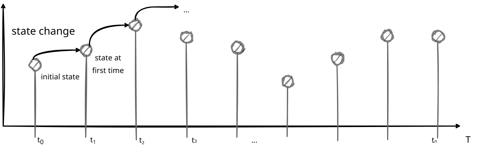
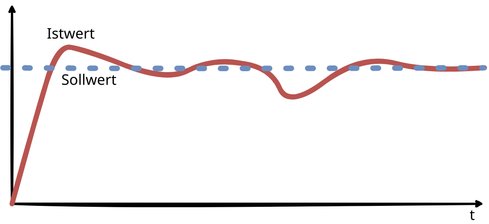

# Task 1 (16 pt): Modeling and Simulation: Theory…

## Deduktive Modellierung
Deduktive Modellierung beschreibt die Modellbildung aufgrund von Einsicht und Kenntnissen über das System.
Diese beruhen auf:
- Gesetzen und Prinzipien
- Grundlagen und Lehrmeinungen
- Wissen über die Systemstruktur

Allgemein gültige Gesetze und Kennntnise werden zu für den Anwendungsfall spezifischen Modellen übergeführt.

## Induktive Modellierung
Bei induktiver Modellierung wird das Modell aufgrund von Annahmen, Beobachtungen und grundlegenden Modellierungsansätzen erstellt. Es werden Theorien und Hypothesen aufgestellt.

### Vorgehen bei induktiver Modellierung
- Welche Größen des Systems sind für die Modellbildung relevant?
- Aufstellen welche Zusammenhänge zwischen den Modellgrößen bestehen
-  Finden von Rückkopplungskreisen
-  Finden von grundsätzlichen Modellgleichungen für die Modellbildung
-  Identifikation der relevanten Parameter zu bestmöglichen Systemabbildung

## Modellbasiertes Problemlösen

Innerhalb der Modellwelt erfolgt die Lösung der Aufgabe. Das Problem kann durch Experimentieren mit dem Modell oder durch die Anwendung mathematischer Verfahren und Theorien erfolgen.

### Modellierung
Für ein reales System wird ein Modell gebildet. Es kann sich dabei um künstliche oder natürliche Systeme handeln, welche bereits existieren oder nur geplant sein können.   
### Abstraktion
Abstraktion ist der Prozess, bei dem die Details eines Systems oder eines Objekts ausgeblendet werden, um sich auf die wesentlichen Aspekte zu konzentrieren. Dabei werden unwichtige Details ausgeklammert, sodass man nur das betrachtet, was für das aktuelle Problem relevant ist.
### Idealisierung
Idealisierung beschreibt die Vereinfachung eines Modells oder einer Theorie, indem man bestimmte reale Bedingungen ausklammert oder vereinfachte Annahmen trifft. Dies dient dazu, komplexe Systeme leichter analysieren zu können, auch wenn die Realität komplexer ist.
### Vereinfachung
Vereinfachung geht noch einen Schritt weiter als Abstraktion oder Idealisierung, indem sie gezielt komplexe Details entfernt, um ein Modell zugänglicher oder leichter verständlich zu machen. Dabei nimmt man bewusst in Kauf, dass bestimmte Informationen verloren gehen oder dass das Modell weniger präzise ist.
### Aggregation
Aggregation bedeutet, dass mehrere Einheiten oder Informationen zu einem Ganzen zusammengefasst werden. Durch die Zusammenführung von Daten oder Objekten entstehen oft neue Bedeutungen oder Muster, die im Detail nicht sichtbar wären.
## Kontinuierliche Modellierung und Simulation
Die Modellierung erfolgt in Modellformalismen, das sind grundlegende Simulationsansätze, die sich hauptsächlich in der Modellierung der Zeit unterscheiden.

Kontinuierliches (stetiges) Vehalten wird mittels Differentialsystemen modelliert. Bei der Simulation kommt numerische Integration zum Einsatz. Um von einem Stützpunkt zum nächsten rechnen zu können, muss das kontinuierliche Verhalten diskretisiert werden.

## Diskrete Modellierung und Simulation

### Diskrete schrittweise Simulation

Diese Modelle werden mit Differenzensysteme und endlichen Automaten abgebildet. Zustände werden anhand von definierten
Überführungsfunktionen von einem Zeitpunkt in den nächsten überführt. Bei der Simulation kommt Time Slicing (zeitgetaktetes Verfahren) zum Einsatz. 

### Diskrete ereignisorientierte Simulation

Bei diskretenen Ereignissystemen (DEVS) werden Zustandsänderungen nur bei Ereignissen der betroffenen Zustände durchgeführt. Diese Ereignisse können immer auftreten,es gibt also keinen fixen zeitlichen Takt. Deie Zeitspanne zwischen den Ereignissen ist wesentlich. Simuliert werden solche Systeme mit Ereignislisten. Dabei wird die Liste von einem Ereignis zum nächsten abgearbeitet.

## Regelkreise
Oft soll eine physikalische Größe (z.Bsp.: Druck, Durchfluss,Temperatur) einen gewünschten Sollwert annehmen. Soll diese Größe ihren Wert beibehalten, selbst wenn äußere, nicht konstante und vorhersehbare Bedingungen auf sie einwirken so ist eine Regelung erforderlich.

Regelkreise sind Rückkopplungskreise, man spricht auch von Feedback im System.

In der Praxis werden sehr häufig PID-Regler angewandt. Sie  bestehen aus 3 mathematischen Prinzipien:
-  Proportionalanteil P: Stellgröße abhängig von der aktuellen Abweichung
- Integralanteil I: Stellgröße abhängig von der Summe der Abweichungen
- Differentialanteil: Stellgröße abhängig von der aktuellen Veränderung der Abweichung

Wesentlich für die korrekte Funktionsweise der Regelung ist die Wahl der richtigen Regler-Parameter.

---
#### Quellen:

- Foliensatz von Herrn Prof. Stephan Winkler

- Unterlagen von Herrn Prof. Herbert Prähofer

https://www.ssw.uni-linz.ac.at/General/Staff/HP/SimTech_SS04/Folien/08-DeduktiveModellierung.pdf
https://ssw.jku.at/General/Staff/HP/SimTech_SS04/Folien/09-InduktiveModellierung.pdf
https://ssw.jku.at/General/Staff/HP/SimTech_SS04/Folien/07-Regelkreise.pdf

*beide Foliensätze beruhen auf folgender Literatur:*
F.E. Cellier, Continuous System Modeling, Springer, 1991
D. Kelton, Simulation with Arena, McGrawHill, 1998.

--- 