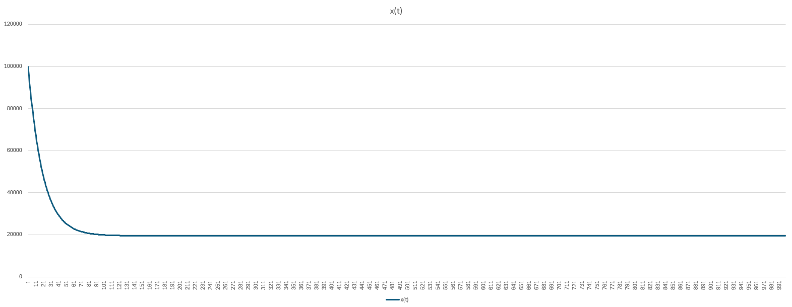
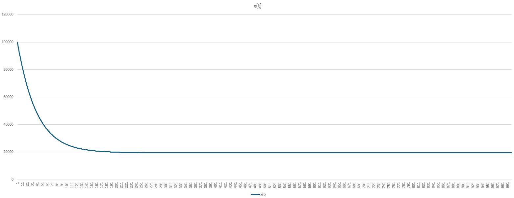
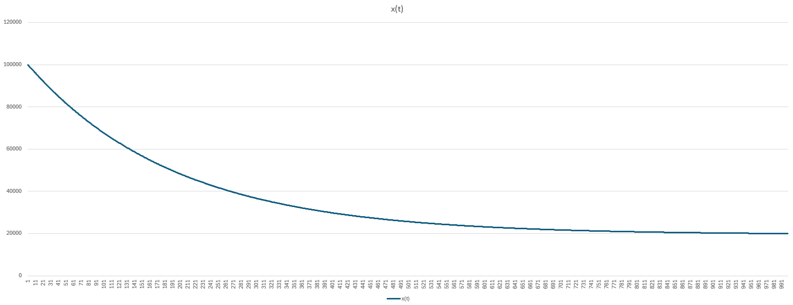
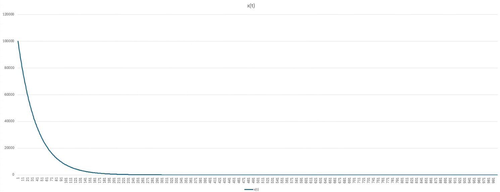

# Task 2 (8 pt): … and a bit of Practice

$x(t)...Wasservolumen \space zum \space Zeitpunkt \space \bold{t}$
$x(0)...Initiales \space Wasservolumen \space [l]$

$x'(t) = \space ?$

Vorgehensweise: Aufteilen des Modells in $\bold{I} \space prozentuelle Abnahme$ und $\bold{II} \space konstanter Zufluss$.

$\bold{I:} \space 5\% \space Abnahme$:
$x(t)=x(0)*0.95^t$
$x(t)=x(0)*e^{ln(0.95)*t}$
$x'(t)=x(0)*e^{ln(0.95)*t}*ln(0.95)$
$x'(t)=x(0)*ln(0.95)$

$\bold{II:} \space 1000l \space konstanter \space Zufluss \space 1000l/h$:
$x'(t)=1000$

Führen nun beide Modelle zusammen lässt sich folgende Gleichung aufstellen:

$x'(t)=x(t)*ln(0.95)+1000$

---

Für die Simulation kann folgende Iterationsvorschrift erstellt werden:
$tStep...Schrittweite \space der \space Simulation$
$i...IndexVariable \space der \space Simulationsschritte$

$x(0)=100000$
$x'(i)=x(i) * ln(0.95) + 10000$
$x(i+1) = x(i)+x'(i)*tStep$

Dieses Verfahren ist allgemein bekannt unter *explizites Eulerverfahren*.

---
## Ergebnisse

Ergebnis mit $tStep=1.0$

$Equilibrium...19495.72575l$
Erreicht nach ~430 Iterations-Schritten -> ~430h

---

Ergebnis mit $tStep=0.5$

$Equilibrium...19495.72575l$
Erreicht nach ~885 Iterations-Schritten -> ~442.5h

---

Ergebnis mit $tStep=0.1$

$Equilibrium...19495.72575l$
Erreicht nach ~4460 Iterations-Schritten -> ~446h

>Für die Feststellung des Equilibriums wurden 5 Nachkommastellen betrachtet.

---

Der Inflow ist in der Angabe als optional definiert, deshalb wurde auch eine Simulation ohne Inflow durchgeführt.

Ergebnis mit $tStep=0.5$

Wenig überraschend nähert sich der Endzustand asymptotisch gegen 0.
