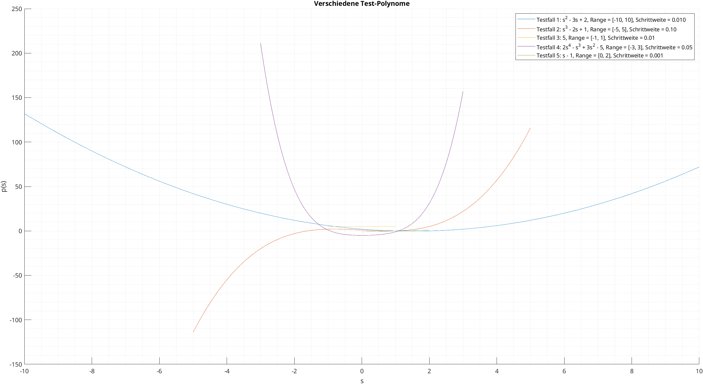

# Aufgabe 1 MATLAB

## Lösungsidee
Die Funktions-Schnittstelle enthält einen Double-Vektor für die Koeffizienten des Polynoms, einen Double-Vektor für die Bereichs-Intervall-Angabe der grafischen Repräsentation und einen optionalen Parameter für die Angabe der Simulations-Schrittweite. 

Im nächsten Schritt wird ein Vektor für die Werte der unabhängigen Variable $s$ innerhalb des angegebenen Bereiches erstellt. Das Intervall der Werte von $s$ ergibt sich aus der übergebenen Schrittweite.

In einer Schleife wird über die Koeffizienten nun das Polynom für jedes Element des vorhin erstellten $s$-Vektors durch aufsummieren der ermittelten Terme berechnet und einem Ergebnis-Vektor $p$ hinzugefügt.

Nun verfügt man über einen $s$-Vektor der Werte der unabhängigen Variable innerhalb des definierten Bereiches und einen $p$-Vektor der ermittelten dazugehörigen Polynome. Diese Werte ($s$) werden im letzten Schritt gegen die berechneten Werte $p$ gezeichnet.

```matlab
function draw_polynomial(coeffs, range, step_size)
arguments
    coeffs double
    range double 
    step_size double = 0.01
end

% s-Vektor über ganze Range erstellen
s = range(1):step_size:range(2);

% Anzahl an koeffizienten ermitteln
n_coeffs = size(coeffs, 2);

% Ergebnis-Vektor mit lauter 0 initialisieren
p = zeros(size(s));

legend_text = 'p = ';

for i = 1:n_coeffs
    % Terme des Polynoms aufsummieren
    p = p + coeffs(i) * s.^(n_coeffs - i);

    % Text für Plot-Legende erstellen
        if coeffs(i) < 0
            legend_text(end) = [];
        end
        legend_text = [legend_text, num2str(coeffs(i)), '*s^', num2str(n_coeffs-i), '+'];
end

% letztes appendedes '+' entfernen
legend_text(end) = [];

% Plot
plot(s, p);
xlabel('s')
ylabel('p(s)')
legend(legend_text);
title(['Polynom mit Schrittweite = ', num2str(step_size)]);
grid minor;
end
```
>**INFO:** 
Innerhalb der Schleife zur Polynom-Ermittlung wird auch noch der Legenden-Text für den entsprechenden Term erstellt. Wenn ein Koeffizient negativ ist, wird das vorherige $+$-Zeichen entfernt, um das Format der Legende korrekt anzuzeigen. Am Ende der Schleife wird das letzte +Zeichen entfernt, da es nach dem letzten Term nicht benötigt wird.


## Aufruf der Funktion
```
>> coeffs = [5 -3 0 1 2 0]
coeffs =
     5    -3     0     1     2     0
>> range = [ -10 10]
range =
   -10    10
>> draw_polynomial(coeffs, range);
```


{ width="550" style="display: block; margin: 0 auto" }


## Ergebnisse

{ width="550" style="display: block; margin: 0 auto" }

Trotz unterschiedlicher Schrittweite kommt es **nicht** zu Skalierungsproblemen des festgelegten Bereichs. :smile: :white_check_mark:

>**INFO:**
Der Code für den Testaufbau ist im Dokumenten-Anhang.

<!-- pagebreak -->

# Aufgabe 2 Electrical engineering basics: The series resonant circuit
Im ersten Schritt wird das System durch Aufstellen der Differential-Gleichungen für $i(t)$ und $y(t)$ und Definieren der $A \ B \ C$-Matrizzen in die Standardform gebracht.

## Analyse und Aufstellen der Standardform
$u=R_1*i+L*i\ ' + y$  &nbsp; &nbsp; &nbsp; &nbsp; *wir legen fest* &nbsp; &nbsp; &nbsp; &nbsp; $x_1(t)=i(t)$
$i=\frac{1}{R_2}*y+C*y\ '$  &nbsp; &nbsp;  &nbsp; &nbsp;&nbsp; &nbsp; &nbsp; &nbsp; *wir legen fest* &nbsp; &nbsp; &nbsp; &nbsp; $x_2(t)=y(t)$


$x(t)=
\begin{bmatrix}
i(t) \\
y(t)
\end{bmatrix} =
\begin{bmatrix}
x_1(t) \\
x_2(t)
\end{bmatrix}$

##### Ermittlung von $x_1 \ '$ 

$u=R_1*x_1+L*x_1 ' + x_2$
$x_1\ '=?$
Umformschritte:
$L*x_1\ ' = u - R1*x_1-x_2$
$x_1\ '= -\frac{R_1}{L} *x_1 - \frac{1}{L} *x_2 + \frac{1}{L} * u$


##### Ermittlung von $x_2 \ '$

$i=\frac{1}{R_2} * x_2 + C * x_2 \ '$
$x_2\ '=?$
Umformschritte:
$x_1=\frac{1}{R_2} * x_2 + C * x_2 \ '$ 
$C*x_2 \ ' = x_1 - \frac{1}{R_2}*x_2$
$x_2\ '= \frac{1}{C} * x_1 - \frac{1}{R_2*C}*x_2$

##### Aufstellen der $A$-Matrix anhand der Koeffizienten von $x_1$ und $x_2$ in den Gleichungen $x_1 \ '$ und $x_2 \ '$

$A=
\begin{bmatrix}
-\frac{R_1}{L} \ -\frac{1}{L} \\
\frac{1}{C} \ -\frac{1}{R_2*C} \\
\end{bmatrix}
$

##### Aufstellen der $B$-Matrix aufgrund der Koeffizienten von $u$ in den Gleichungen $x_1 \ '$ und $x_2 \ '$

$B=
\begin{bmatrix}
\frac{1}{L} \\
0
\end{bmatrix}
$

##### Aufstellen der $C$-Matrix aufgrund $y=x_2$
($i$ also $x_1$ hat keinen direkten Einfluss auf die Ausgabe)

$C =
\begin{bmatrix}
0 \ 1
\end{bmatrix}
$

<!-- pagebreak -->

## Symbolische Lösung mit *Symbolic Math Toolbox*
Die vorhin aufgestellten Differentialgleichungen $x_1 \ '$ und $x_2 \ '$ können nun für die Ermittlung der symbolischen Lösung mittels der *Symbolic Math Toolbox* verwendet werden.
Im ersten Schritt werden die durch die vorangegangene Analyse identifizierten und relevanten Symbole und benötigten Gleichungen in Matlab-Code gegossen.
- Die Symbole $R_1$, $R_2$, $L$, $C$, $u$, die Zeit $t$, $x_1(t)$ und $x_2(t)$   müssen definiert werden.
- Es werden auch konkrete Werte für $R_1$, $R_2$, $L$, $C$ und $u$ festgelegt. Diese Werte werden später in die symbolischen Lösungen eingesetzt.
- Übertragen der Differentialgleichungen $x_1 \ '$ und $x_2 \ '$

Als nächstes wird mit `dsolve` die symbolische Lösung ermittelt. Als Anfangsbedingungen (diese müssen ebenfalls übergeben werden) wird davon ausgegangen, dass $x_1(t)$ und $x_2(t)$ initial $0$ sind.

Mit `subs` können nun die symbolischen Lösungen für $x_1(t)$ und $x_2(t)$ mit den konkreten Parameterwerten ausgewertet werden. `subs` retouniert  die symbolische Lösung der Differentialgleichungen für die Zustandsvariablen. 

Zur Ausgabe wird `fplot` verwendet. An diese Funktion wird der vorhin mit `subs` ermittelte symbolische Ausdruck für $x_2(t)$ und ein Vektor zum Definieren des Zeitbereichs übergeben. (Im konkreten Fall `[0, 100]`). 

```matlab
% Symbole
syms R1 R2 L C t u x1(t) x2(t)

% Parameterwerte
R1_val = 0.1;  
R2_val = 10.0;   
L_val = 1.0;  
C_val = 1.0;
u_val = 1;

% Differentialgleichungen definieren
Dx1 = diff(x1, t) == -R1/L * x1 - 1/L * x2 + u/L;
Dx2 = diff(x2, t) == 1/C * x1 - 1/(R2 * C) * x2;

% Anfangsbedingungen
x1_0 = 0;
x2_0 = 0;

% Lösung berechnen
sol = dsolve([Dx1, Dx2], x1(0) == x1_0, x2(0) == x2_0);

% Lösungen für x1(t) und x2(t) extrahieren und mit konkreten Parameter berechnen
x1_sol = subs(sol.x1, [R1, R2, L, C, u], [R1_val, R2_val, L_val, C_val, u_val]);
x2_sol = subs(sol.x2, [R1, R2, L, C, u], [R1_val, R2_val, L_val, C_val, u_val]);

% Plot
fplot(x2_sol, [0, 100]);
title('Spannung y(t) über die Zeit (Symbolische Lösung)');
xlabel('Zeit (s)');
ylabel('Spannung y(t)');
grid on;
```
>**INFO:**
`x1_sol` und `x2_sol` sind keine Vektoren, sondern symbolische Ausdrücke (Funktionen der Zeit $t$). Sie werden in diesem Fall erst beim Plotten ausgewertet.

{ width="500" style="display: block; margin: 0 auto" }

## **Bonus:** Vergleich mit numerischer Lösung mit Runge-Kutta Verfahren *(ode45)*

Für diese Aufgabe wurde ebenfalls ein Verfahren zur numerischen Lösungsermittlung erstellt. Dies bietet zwar keine weitere Sicherheit, ob das Modell richtig aufgestellt wurde, soll jedoch überprüfen ob die *Symbolic Math Toolbox* richtig verwendet wurde. 

```matlab
% Parameterwerte
R1_val = 0.1;  
R2_val = 10.0;   
L_val = 1.0;  
C_val = 1.0;
u_val = 1;

% Matrix A, B, und C in Standardform
A = [ -R1_val / L_val, -1 / L_val;
       1 / C_val,     -1 / (R2_val * C_val) ];

B = [1 / L_val;
     0];

C_matrix = [0, 1];

% Anfangswerte
x0 = [0; 0];  % x1(0) = 0 und x2(0) = 0

% Zeitvektor
t = 0:0.01:100;

% Funktion für die Simulation
dx_dt = @(t, x) A * x + B * u_val;

% Numerische Lösung mit ode45 (Runge Kutta)
[t, x] = ode45(dx_dt, t, x0);

% Berechnung von y(t) = C * x(t)
x2_t = C_matrix * x';

% Plot
plot(t, x2_t);
title('Spannung y(t) über die Zeit (Numerische Lösung)');
xlabel('Zeit (s)');
ylabel('Spannung y(t)');
grid on;
```

{ width="500" style="display: block; margin: 0 auto" }

>**INFO:**
Ein grober erster Vergleich zwischen symbolisch und numerisch ermittelter Lösung ist positiv zu bewerten. 

## Ergebnisse:

### Symbolische Lösung


### Numerische Lösung


>**INFO:**
Der Code für den Testaufbau ist im Dokumenten-Anhang.

# Aufgabe 3 Continuous modeling and systems theory
## Einleitung
Das (A, B, C)-Modell ist eine gängige Methode zur Beschreibung dynamischer Systeme in der Systemtheorie. Es verwendet Zustandsraumdarstellungen, um lineare Differentialgleichungen zu beschreiben. Dabei werden Matrizen $A$, $B$ und $C$ verwendet, um den Zustand, die Inputs und die Outputs des Systems zu modellieren.

## Bedeutung der Matrizen $A$, $B$ und $C$:

- Matrix $A$ beschreibt, wie sich der Zustand des Systems $x(t)$ über die Zeit verändert. Sie hat die Dimensionen $n*n$, wobei $n$ die Anzahl der Zustände des Systems darstellt.
- Matrix $B$ beschreibt den Einfluss der Inputs $u(t)$ auf das System. Ihre Dimension ist $n*m$, wobei $m$ die Anzahl der Eingabegrößen ist.
- Matrix $C$ zeigt, wie die Zustände des Systems auf die Outputs $y(t)$ abgebildet werden. Sie hat die Dimension $p*n$. $p$ ist die Anzahl der Outputs des Systems.

## Vorteile des (A, B, C)-Modells:

- Es ermöglicht eine kompakte und systematische Darstellung dynamischer Systeme.
- Es kann leicht in Software implementiert werden und ist somit geeignet für Simulationen und Regelungsentwürfe.
- Das Modell ist nützlich für die Analyse und das Design von Systemen (und Regelungssystemen).
  
## Nachteile des (A, B, C)-Modells:
- Diese Methode ist nur für lineare Systeme anwendbar. Nichtlineare Systeme können damit nicht exakt beschrieben werden.
- Zeitvariable Systeme (wo  Systemparameter (wie die Matrizen in einer Zustandsraumdarstellung) zeitabhängig sind) können damit nicht exakt beschrieben werden.

## Alternativen, wenn das (A, B, C)-Modell nicht anwendbar ist:
- Die Erweiterung auf nichtlineare Zustandsraumdarstellungen oder die Verwendung anderer Methoden wie der Lyapunov-Theorie
- Numerische Simulation


## Bedeutung der Formeln:
### Zustands-Differentialgleichung:
$x \ '(t) = A * x(t) + B * u(t);$ &nbsp; &nbsp; $x(0)=x_0$
Diese Gleichung beschreibt die zeitliche Änderung aller internen Zustände des Systems. Der Term $A*x(t)$ modelliert die Dynamik des Systems selbst, basierend auf dem aktuellen Zustand. Der Term $B*u(t)$ beschreibt den Einfluss des Inputs $u(t)$ auf den Zustand. Die Anfangsbedingung $x(0)=x_0$ gibt den Zustand des Systems zum Zeitpunkt $t=0$ an.

### Ausgabe-Gleichung:
$y(t) = C*x(t)$
Diese Gleichung stellt den Output des Systems, $y(t)$, in Abhängigkeit vom Zustand $x(t)$ dar. Die Matrix $C$ gibt an, wie die internen Zustände auf die System-Outputs abgebildet werden.

### Lösung der Zustands-Gleichung:
$x(t) = e^{tA} x(0) + \int_0^t e^{(t - \tau)A} B u(\tau) \, d\tau$
Diese Gleichung gibt eine Lösung für den Zustand $x(t)$ in Abhängigkeit von der Anfangsbedingung $x(0)$ und dem Eingabesignal $u(t)$. Der erste Term $e^{tA}x(0)$ beschreibt, wie sich der Anfangszustand über die Zeit entwickelt. Der zweite Term (das Integral) repräsentiert die kumulative Wirkung der Eingabe $u(t)$ auf das System über die Zeit.

### Lösung der Ausgabe-Gleichung
$y(t) = C e^{tA} x(0) + \int_0^t C e^{(t - \tau)A} B u(\tau) \, d\tau$
Diese Gleichung beschreibt die Ausgabe $y(t)$ des Systems als Funktion der Anfangszustände und des Eingabesignals $u(t)$. Der erste Term $Ce^{tA}x(0)$ zeigt, wie die Anfangsbedingungen zum Output beitragen, und der zweite Term, das Integral, beschreibt die Auswirkung des Inputs $u(t)$ auf die Outputs über die Zeit.

$\tau$ wird in den beiden Gleichungslösungen als Variable verwendet, die von $0$ bist zum aktuellen Zeitpunkt $t$ läuft. Sie sorgt beim Integrieren dafür, dass die Wirkung von $u(\tau)$ über die Zeit im aktuellen Zustand $x(t)$ berücksichtigt wird.

<!-- pagebreak -->

# Anhang:

## Testcode Aufgabe 1

```matlab
figure;
hold on;
legend_entries = {}; % Zelle für die Legendentexte

% Testfall 1
coeffs1 = [1, -3, 2];
range1 = [-10, 10];
step_size1 = 0.01;
draw_polynomial(coeffs1, range1, step_size1);
legend_entries{end+1} = sprintf('Testfall 1: s^2 - 3s + 2, Range = [%d, %d], Schrittweite = %.3f', range1(1), range1(2), step_size1);

% Testfall 2
coeffs2 = [1, 0, -2, 1];
range2 = [-5, 5];
step_size2 = 0.1;
draw_polynomial(coeffs2, range2, step_size2);
legend_entries{end+1} = sprintf('Testfall 2: s^3 - 2s + 1, Range = [%d, %d], Schrittweite = %.2f', range2(1), range2(2), step_size2);

% Testfall 3
coeffs3 = [5];
range3 = [-1, 1];
step_size3 = 0.01; % Standard-Schrittweite verwenden
draw_polynomial(coeffs3, range3);
legend_entries{end+1} = sprintf('Testfall 3: 5, Range = [%d, %d], Schrittweite = %.2f', range3(1), range3(2), step_size3);

% Testfall 4
coeffs4 = [2, -1, 3, 0, -5];
range4 = [-3, 3];
step_size4 = 0.05;
draw_polynomial(coeffs4, range4, step_size4);
legend_entries{end+1} = sprintf('Testfall 4: 2s^4 - s^3 + 3s^2 - 5, Range = [%d, %d], Schrittweite = %.2f', range4(1), range4(2), step_size4);

% Testfall 5
coeffs5 = [1, -1];
range5 = [0, 2];
step_size5 = 0.001;
draw_polynomial(coeffs5, range5, step_size5);
legend_entries{end+1} = sprintf('Testfall 5: s - 1, Range = [%d, %d], Schrittweite = %.3f', range5(1), range5(2), step_size5);

legend(legend_entries);
title('Verschiedene Test-Polynome')

hold off;
disp('Testskript abgeschlossen.');
```

## Testcode Aufgabe 2
### Testcode Symbolische Lösung
```matlab
% Symbole
syms R1 R2 L C t u x1(t) x2(t)

% Parameterkombinationen
params = [
    2.0, 0.5, 1.0, 1.0;   
    0.5, 20.0, 1.0, 1.0;  
    5.0, 25.0, 1.0, 1.0;
    0.1, 10.0, 0.1, 0.1;  
    0.1, 10.0, 10.0, 10.0; 
    3.0, 6.0, 1.0, 1.0
];

% Anfangsbedingungen
x1_0 = 0;
x2_0 = 0;
u_val = 1;

% Differentialgleichungen definieren
Dx1 = diff(x1, t) == -R1/L * x1 - 1/L * x2 + u/L;
Dx2 = diff(x2, t) == 1/C * x1 - 1/(R2 * C) * x2;

sol = dsolve([Dx1, Dx2], x1(0) == x1_0, x2(0) == x2_0);

time_range = [0, 100];

% Plot für jede Parameterkombination
figure;
hold on;
for i = 1:size(params, 1)
    % Aktuelle Parameterwerte
    R1_val = params(i, 1);
    R2_val = params(i, 2);
    L_val = params(i, 3);
    C_val = params(i, 4);
    
    % Lösungen x2(t) berechnen und substituieren
    x2_sol = subs(sol.x2, [R1, R2, L, C, u], [R1_val, R2_val, L_val, C_val, u_val]);
    
    % Plot x2(t) mit den aktuellen Parameterwerten
    fplot(x2_sol, time_range, 'DisplayName', sprintf('R1=%.2f, R2=%.2f, L=%.2f, C=%.2f', R1_val, R2_val, L_val, C_val));
end

% Plot
title('Spannung y(t) über die Zeit für verschiedene Parameterkombinationen (Symbolische Lösung)');
xlabel('Zeit (s)');
ylabel('Spannung y(t)');
legend show;
grid on;
hold off;
```

### Testcode Numerische Lösung
```matlab
% Parameterkombinationen
params = [
    2.0, 0.5, 1.0, 1.0;   
    0.5, 20.0, 1.0, 1.0;  
    5.0, 25.0, 1.0, 1.0;
    0.1, 10.0, 0.1, 0.1;  
    0.1, 10.0, 10.0, 10.0; 
    3.0, 6.0, 1.0, 1.0
];

% Anfangswerte
x0 = [0; 0];  % x1(0) = 0 und x2(0) = 0

% Zeitvektor
t = 0:0.01:100;

% Plot für jede Parameterkombination
figure;
hold on;
for i = 1:size(params, 1)
    % Aktuelle Parameterwerte
    R1_val = params(i, 1);
    R2_val = params(i, 2);
    L_val = params(i, 3);
    C_val = params(i, 4);
    u_val = 1;

    % Matrix A, B und C_matrix in Standardform
    A = [ -R1_val / L_val, -1 / L_val;
           1 / C_val,     -1 / (R2_val * C_val) ];

    B = [1 / L_val;
         0];

    C_matrix = [0, 1];

    % Funktion für die Simulation
    dx_dt = @(t, x) A * x + B * u_val;

    % Numerische Lösung mit ode45 (Runge-Kutta)
    [t, x] = ode45(dx_dt, t, x0);

    % Berechnung y(t) = C * x(t)
    x2_t = C_matrix * x';

    % Plot y(t) für aktuelle Parameterkombination
    plot(t, x2_t, 'DisplayName', sprintf('R1=%.2f, R2=%.2f, L=%.2f, C=%.2f', R1_val, R2_val, L_val, C_val));
end

% Plot
title('Spannung y(t) über die Zeit für verschiedene Parameterkombinationen (Numerische Lösung)');
xlabel('Zeit (s)');
ylabel('Spannung y(t)');
legend show;
grid on;
hold off;

```