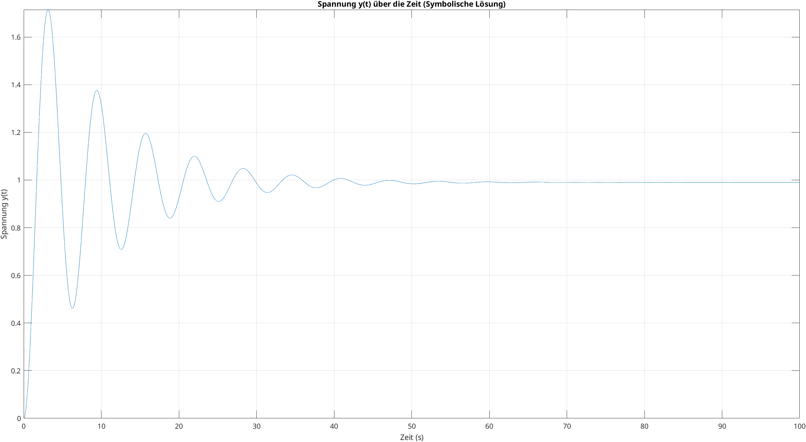

# Aufgabe 1 MATLAB

## Lösungsidee
Als erstes wird die Funktions-Schnittstelle definiert.
Sie enthält einen Double-Vektor für die Koeffizienten des Polynoms, einen Double-Vektor für die Bereichs-Intervall-Angabe der grafischen Repräsentation und einen optionalen Parameter für die Angabe der Simulations-Schrittweite. 

Im nächsten Schritt wird ein Vektor für die Werte der unabhängigen Variable $s$ innerhalb des angegebenen Bereiches erstellt. Das Intervall der Werte von $s$ ergibt sich aus der übergebenen Schrittweite.

In einer Schleife wird über die Koeffizienten wird nun das Polynom für jedes Element des vorhin erstellten $s$-Vektors durch aufsummieren der ermittelten Terme berechnet und einem Ergebnis-Vektor $p$ hinzugefügt.

Nun verfügt man über einen $s$-Vektor der Werte der unabhängigen Variable innerhalb des definierten Bereiches und einen $p$-Vektor der ermittelten dazugehörigen Polynome. Diese werden im letzten Schritt $s$ gegen die berechneten Werte $p$ gezeichnet.

```matlab
function draw_polynomial(coeffs, range, step_size)
arguments
    coeffs double
    range double 
    step_size double = 0.01
end

% s-Vektor über ganze Range erstellen
s = range(1):step_size:range(2);

% Anzahl an koeffizienten ermitteln
n_coeffs = size(coeffs, 2);

% Ergebnis-Vektor mit lauter 0 initialisieren
p = zeros(size(s));

legend_text = 'p = ';

for i = 1:n_coeffs
    % Terme des Polynoms aufsummieren
    p = p + coeffs(i) * s.^(n_coeffs - i);

    % Text für Plot-Legende erstellen
        if coeffs(i) < 0
            legend_text(end) = [];
        end
        legend_text = [legend_text, num2str(coeffs(i)), '*s^', num2str(n_coeffs-i), '+'];
end

% letztes appendedes '+' entfernen
legend_text(end) = [];

% Plot
plot(s, p);
xlabel('s')
ylabel('p(s)')
legend(legend_text);
title(['Polynom mit Schrittweite = ', num2str(step_size)]);
grid minor;
end
```
>**INFO:** 
Innerhalb der Schleife zur Polynom-Ermittlung wird auch noch der Legenden-Text für den entsprechenden Term erstellt. Wenn ein Koeffizient negativ ist, wird das vorherige $+$-Zeichen entfernt, um das Format der Legende korrekt anzuzeigen. Am Ende der Schleife wird das letzte +-Zeichen entfernt, da es nach dem letzten Term nicht benötigt wird.


## Aufruf der Funktion
```
>> coeffs = [5 -3 0 1 2 0]

coeffs =

     5    -3     0     1     2     0

>> range = [ -10 10]

range =

   -10    10

>> draw_polynomial(coeffs, range);
```


# Aufgabe 2
Im ersten Schritt wird das System durch Aufstellen der Differential-Gleichungen für $i(t)$ und $y(t)$ in die Standardform gebracht.

## Analyse und Aufstellen der Standardform
$u=R_1*i+L*i\ ' + y$  &nbsp; &nbsp; &nbsp; &nbsp; *wir legen fest* &nbsp; &nbsp; &nbsp; &nbsp; $x_1(t)=i(t)$
$i=\frac{1}{R_2}*y+C*y\ '$  &nbsp; &nbsp;  &nbsp; &nbsp;&nbsp; &nbsp; &nbsp; &nbsp; *wir legen fest* &nbsp; &nbsp; &nbsp; &nbsp; $x_2(t)=y(t)$


$x(t)=
\begin{bmatrix}
i(t) \\
y(t)
\end{bmatrix} =
\begin{bmatrix}
x_1(t) \\
x_2(t)
\end{bmatrix}$

##### Ermittlung von $x_1 \ '$ 

$u=R_1*x_1+L*x_1 ' + x_2$
$x_1\ '=?$
Umformschritte:
$L*x_1\ ' = u - R1*x_1-x_2$
$x_1\ '= -\frac{R_1}{L} *x_1 - \frac{1}{L} *x_2 + \frac{1}{L} * u$


##### Ermittlung von $x_2 \ '$

$i=\frac{1}{R_2} * x_2 + C * x_2 \ '$
$x_2\ '=?$
Umformschritte:
$x_1=\frac{1}{R_2} * x_2 + C * x_2 \ '$ 
$C*x_2 \ ' = x_1 - \frac{1}{R_2}*x_2$
$x_2\ '= \frac{1}{C} * x_1 - \frac{1}{R_2*C}*x_2$

##### Aufstellen der $A$-Matrix anhand der Koeffizienten von $x_1$ und $x_2$ in den Gleichungen $x_1 \ '$ und $x_2 \ '$

$A=
\begin{bmatrix}
-\frac{R_1}{L} \ -\frac{1}{L} \\
\frac{1}{C} \ -\frac{1}{R_2*C} \\
\end{bmatrix}
$

##### Aufstellen der $B$-Matrix aufgrund der Koeffizienten von $u$ in den Gleichungen $x_1 \ '$ und $x_2 \ '$

$B=
\begin{bmatrix}
\frac{1}{L} \\
0
\end{bmatrix}
$

##### Aufstellen der $C$-Matrix aufgrund $y=x_2$
($i$ also $x_1$ hat keinen direkten Einfluss auf die Ausgabe)

$C =
\begin{bmatrix}
0 \ 1
\end{bmatrix}
$

## Symbolische Lösung mit *Symbolic Math Toolbox*

Die vorhin aufgestellten Differentialgleichungen $x_1 \ '$ und $x_2 \ '$ können nun für die Ermittlung der symbolischen Lösung mittels der *Symbolic Math Toolbox* verwendet werden.

Im ersten Schritt werden die durch die vorangegangene Analyse identifizierten und relevanten Symbole und benötigten Gleichungen in Matlab-Code gegossen.
- Die Symbole $R_1$, $R_2$, $L$, $C$, $u$, die Zeit $t$, $x_1(t)$ und $x_2(t)$   müssen definiert werden.
- Es werden auch konkrete Werte für $R_1$, $R_2$, $L$, $C$ und $u$ festgelegt. Diese Werte werden später in die symbolischen Lösungen eingesetzt, um eine konkrete numerische Lösung zu erhalten.
- Übertragen der Differentialgleichungen $x_1 \ '$ und $x_2 \ '$

Als nächstes wird mit `dsolve` die symbolische Lösung ermittelt. Als Anfangsbedingungen (diese müssen ebenfalls übergeben werden) wird davon ausgegangen, dass $x_1(t)$ und $x_2(t)$ initial $0$ sind.

Mit `subs` können nun die symbolischen Lösungen für $x_1(t)$ und $x_2(t)$ mit den konkreten Parameterwerten ausgewertet werden. `subs` retouniert  die symbolische Lösung der Differentialgleichungen für die Zustandsvariablen. 

Zur Ausgabe wird `fplot` verwendet. An diese Funktion wird der vorhin mit `subs` ermittelte symbolische Ausdruck für $x_2(t)$ und ein Vektor zum definieren des Zeitbereichs übergeben. (Im konkreten Fall `[0, 100]`). 

```matlab
% Symbole
syms R1 R2 L C t u x1(t) x2(t)

% Parameterwerte
R1_val = 0.1;  
R2_val = 10.0;   
L_val = 1.0;  
C_val = 1.0;
u_val = 1;

% Differentialgleichungen definieren
Dx1 = diff(x1, t) == -R1/L * x1 - 1/L * x2 + u/L;
Dx2 = diff(x2, t) == 1/C * x1 - 1/(R2 * C) * x2;

% Anfangsbedingungen
x1_0 = 0;
x2_0 = 0;

% Lösung berechnen
sol = dsolve([Dx1, Dx2], x1(0) == x1_0, x2(0) == x2_0);

% Lösungen für x1(t) und x2(t) extrahieren und mit konkreten Parameter berechnen
x1_sol = subs(sol.x1, [R1, R2, L, C, u], [R1_val, R2_val, L_val, C_val, u_val]);
x2_sol = subs(sol.x2, [R1, R2, L, C, u], [R1_val, R2_val, L_val, C_val, u_val]);

% Plot
fplot(x2_sol, [0, 100]);
title('Spannung y(t) über die Zeit (Symbolische Lösung)');
xlabel('Zeit (s)');
ylabel('Spannung y(t)');
grid on;
```
>**INFO:**
`x1_sol` und `x2_sol` sind keine Vektoren, sondern symbolische Ausdrücke (Funktionen der Zeit $t$). Sie werden erst beim Plotten ausgewertet.



## **Bonus:** Vergleich mit numerischer Lösung mit Runge-Kutta Verfahren *(ode45)*

Für diese Aufgabe wurde ebenfalls ein Verfahren zur numerischen Lösungsermittlung erstellt. Dies bietet zwar keine weitere Sicherheit, ob das Modell richtig aufgestellt wurde, soll jedoch überprüfen ob die *Symbolic Math Toolbox* richtig verwendet wurde. 

```matlab
% Parameterwerte
R1_val = 0.1;  
R2_val = 10.0;   
L_val = 1.0;  
C_val = 1.0;
u_val = 1;

% Matrix A, B, und C in Standardform
A = [ -R1_val / L_val, -1 / L_val;
       1 / C_val,     -1 / (R2_val * C_val) ];

B = [1 / L_val;
     0];

C_matrix = [0, 1];

% Anfangswerte
x0 = [0; 0];  % x1(0) = 0 und x2(0) = 0

% Zeitvektor
t = 0:0.01:100;

% Funktion für die Simulation
dx_dt = @(t, x) A * x + B * u_val;

% Numerische Lösung mit ode45 (Runge Kutta)
[t, x] = ode45(dx_dt, t, x0);

% Berechnung von y(t) = C * x(t)
x2_t = C_matrix * x';

% Plot
plot(t, x2_t);
title('Spannung y(t) über die Zeit (Numerische Lösung)');
xlabel('Zeit (s)');
ylabel('Spannung y(t)');
grid on;
```


>**INFO:**
Ein grober erster Vergleich zwischen symbolisch und numerisch ermittelter Lösung ist positiv zu bewerten. 

## Ergebnisse:

### Symbolische Lösung


### Numerische Lösung


>**INFO:**
Der Code für den Testaufbau ist im Dokumenten-Anhang.