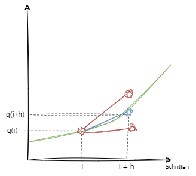

# Aufgabe 1
## a)
### I)
{ width="400" style="display: block; margin: 0 auto" }

$x(t)=
\begin{bmatrix}
z(t) \\
v(t) \\
x(t)
\end{bmatrix} =
\begin{bmatrix}
x_1(t) \\
x_2(t) \\
x_3(t)
\end{bmatrix}$

$
u(t) =
\begin{bmatrix}
U_1(t) \\
U_2(t)
\end{bmatrix}
$

$x_1 \ ' = 2 \cdot (U_1 + U_2)$
$x_2 \ ' = x_1 - U_2$
$x_3 \ ' = x_2$

$
y_1 = x_2 \\
y_2 = x_3
$

Zeilen sind Differentialgleichungen der Zustandsvariablen und Spalten die Koeffizienten der Zustandsvariablen

$A=
\begin{bmatrix}
0 \quad  0 \quad   0 \\
1 \quad 0 \quad 0 \\
0 \quad 1 \quad 0
\end{bmatrix}
$

Zeilen sind Differentialgleichungen der Zustandvariablen, Spalten sind Koeffizienten der Inputs

$B=
\begin{bmatrix}
2 \quad 2 \\
0  -1 \\
0 \quad 0
\end{bmatrix}
$

Zeilen sind die Outputs, KoeffizientenSpalten sind die Zustandsvariablen die sich gewichtet auf die Outputs auswirken

$C=
\begin{bmatrix}
0 \quad 1 \quad 0 \\
0 \quad 0 \quad 1
\end{bmatrix}
$

<!-- pagebreak -->

### II)

{ width="400" style="display: block; margin: 0 auto" }

$x(t)=
\begin{bmatrix}
z(t) \\
x(t)
\end{bmatrix} =
\begin{bmatrix}
x_1(t) \\
x_2(t) 
\end{bmatrix}$

$
u(t) =
\begin{bmatrix}
U_1 \\
U_2 \\
U_3 \\
U_4
\end{bmatrix}
$

$x_1 \ ' = -5 \cdot U_1$
$x_2 \ ' = x_1 + x_2 + -2 \cdot U_2 + U_3 + U_4  $

Zeilen sind Differentialgleichungen der Zustandsvariablen und Spalten die Koeffizienten der Zustandsvariablen

$A=
\begin{bmatrix}
0 \quad  0  \\
1 \quad 1 
\end{bmatrix}
$

Zeilen sind Differentialgleichungen der Zustandvariablen, Spalten sind Koeffizienten der Inputs

$B=
\begin{bmatrix}
-5 \quad 0 \quad 0 \quad 0 \\
0 \ -2 \quad 1 \quad 1
\end{bmatrix}
$

Zeilen sind die Outputs, KoeffizientenSpalten sind die Zustandsvariablen die sich gewichtet auf die Outputs auswirken

$C=
\begin{bmatrix}
0 \quad 1 
\end{bmatrix}
$

<!-- pagebreak -->

## b)

### I)

$
x(t)=
\begin{bmatrix}
x_1(t) \\
x_2(t) \\
x_3(t)
\end{bmatrix}$

$
u(t) =
\begin{bmatrix}
U_1(t) \\
U_2(t) 
\end{bmatrix}
$

$x_1 \ ' = -x_2 + U_1 + 2 \cdot U_2 $
$x_2 \ ' = 2 \cdot x_1 -8 \cdot x_2 + 3 \cdot U_1 - 2 \cdot U_2 $
$x_3 \ ' = -2 \cdot x_1 + x_3 - U_1  + U_2$

$y_1 = x_1$
$y_2 = 2 \cdot x_2$
$y_3 = -x_2 + x_3$
$y_4= 3 \cdot x_2$

<!-- pagebreak -->

### II)

$
x(t)=
\begin{bmatrix}
x_1(t) \\
x_2(t)
\end{bmatrix}$

$
u(t) =
\begin{bmatrix}
U_1 \\
U_2
\end{bmatrix}
$

$x_1 \ ' = -x_1 + x_2 + 2 \cdot U_2$
$x_2 \ ' = x_1 + U_1 - 2 \cdot U_2$

$y = x_2$

## c)
- $A$ ist eine Quadrat-Matrix :white_check_mark:
- In der $B$-Matrix kann die Anzahl der Zeilen nicht stimmen, $B$ muss soviele Zeilen haben, wie es Zustandsvariablen gibt. :x:
- In der $C$-Matrix muss für jede Zustandsvariable eine Spalte existieren. :x:

<!-- pagebreak -->

## d)

$
x(t)=
\begin{bmatrix}
a(t) \\
b(t) \\
c(t)
\end{bmatrix} =
\begin{bmatrix}
x_1(t) \\
x_2(t) \\
x_3(t)
\end{bmatrix}$

$
u(t)=
\begin{bmatrix}
i_1(t) \\
i_2(t)
\end{bmatrix} =
\begin{bmatrix}
U_1(t) \\
U_2(t) \\
\end{bmatrix}$

$x_1 \ ' = 2 \cdot x_1 + 4 \cdot x_2 - 2 \cdot x_3 + 2 \cdot U_1 $
$x_2 \ ' = 4 \cdot x_2 - x_3 + U_2$
$x_3 \ ' = - x_3 + 3 \cdot U_1 $

$y_1 = 3 \cdot x_1$
$y_2 = - x_2$
$y_3 = x_1 - x_3 $

Zeilen sind Differentialgleichungen der Zustandsvariablen und Spalten die Koeffizienten der Zustandsvariablen

$A=
\begin{bmatrix}
2 \quad 4 \quad -2 \\
0 \quad 4 \quad -1 \\
0 \quad 0 \quad -1
\end{bmatrix}
$

Zeilen sind Differentialgleichungen der Zustandvariablen, Spalten sind Koeffizienten der Inputs

$B=
\begin{bmatrix}
 2 \quad 0 \\
 0 \quad 1 \\
 3 \quad 0 \\
\end{bmatrix}
$

Zeilen sind die Outputs, KoeffizientenSpalten sind die Zustandsvariablen die sich gewichtet auf die Outputs auswirken

$C=
\begin{bmatrix}
3 \quad 0  \quad 0 \\ 
0 \quad -1 \quad 0 \\
1 \quad 0  \quad -1
\end{bmatrix}
$
{ width="400" style="display: block; margin: 0 auto" }

<!-- pagebreak -->

# Aufgabe 2
Numerische Integration ist eine Methode, eine Differentialgleichung durch Näherungswerte zu lösen, wenn eine analytische Lösung nicht möglich oder nicht leicht anwendbar ist. In der Simulation von Systemen wird numerische Integration eingesetzt, um zeitliche Verläufe von Zustandsgrößen zu berechnen.

Für das Starten einer Simulation sind neben der Auswahl der numerischen Integrationsmethode folgende Informationen  notwendig:

- **Anfangszustände:** Die Startwerte aller relevanten Zustandsgrößen dienen als Grundlage für die Berechnung der nächsten Schritte.
- **Differentialgleichungen des Systems:** Diese beschreiben, wie sich das System über die Zeit ändert, also die Dynamik des Systems.
- **Schrittweite der Simulation:** Der zeitliche Abstand für die Berechnung der nächsten Zustandswerte. Die Genauigkeit der Simulation hängt maßgeblich von der Größe der Schrittweite ab. Es gibt auch Simulationsverfahren mit variabler Schrittweite.   

Es gibt Alternativen zur numerischen Integration, die sind aber oft nicht anwendbar.
- **Analytische Lösungen:**
Die Gleichung wird mithilfe mathematischer Regeln und Operationen so umgeformt, dass die Lösung in expliziter Form dargestellt werden kann. Das heißt, das Ergebnis ist eine Formel, die alle Lösungen direkt ausdrückt, ohne dass Näherungsverfahren oder numerische Methoden nötig sind.
  - nicht anwendbar bei nichtlinearen Systemen, da keine einfachen Lösungsmethoden vorhanden

Folgende numerische Integrationsmethoden sind mir u.A. bekannt:
- Euler-Verfahren
- Heun-Verfahren
- Runge-Kutta-Verfahren
- Adams-Bashford-Verfahren
- Adams-Moulton-Verfarhen

**Euler-Verfahren:**
Einfachstes Verfahren, bei dem der nächste Wert aus der aktuellen Ableitung berechnet wird:
$q_{i+1}=q_i + h \cdot f(q_i)$
- Vorteil: Einfach zu implementieren.
- Nachteil: Kann ungenau und instabil sein.

Die Schrittweite $h$ gibt an, wie groß der zeitliche Abstand zwischen zwei aufeinanderfolgenden Berechnungspunkten $q_i$ und $q_{i+1}$ in der numerischen Integration ist.

{ width="150" style="display: block; margin: 0 auto" }

<!-- pagebreak -->

**Heun-Verfahren:**
Ein verbesserter Ansatz, der den Durchschnitt der Ableitungen am Anfang und Ende der Schrittweite verwendet:
$q_{i+1}=q_i+\frac{h}{2}\cdot(f(q_i)+f(q_i+h\cdot f(q_i)))$
- Vorteil: Höhere Genauigkeit als das Euler-Verfahren.
- Nachteil: Etwas aufwändiger.

{ width="150" style="display: block; margin: 0 auto" }

