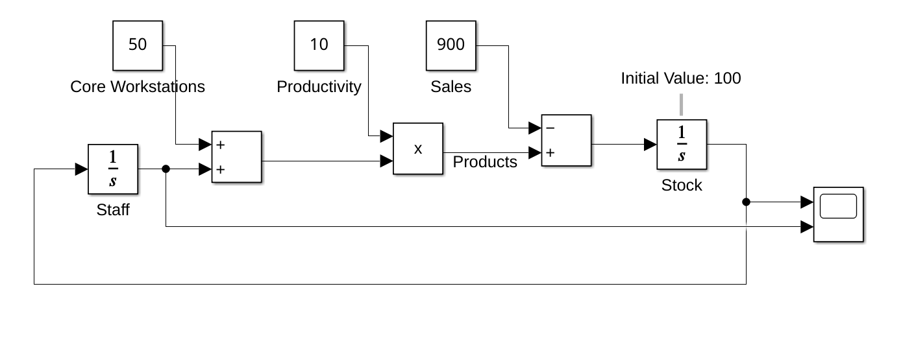
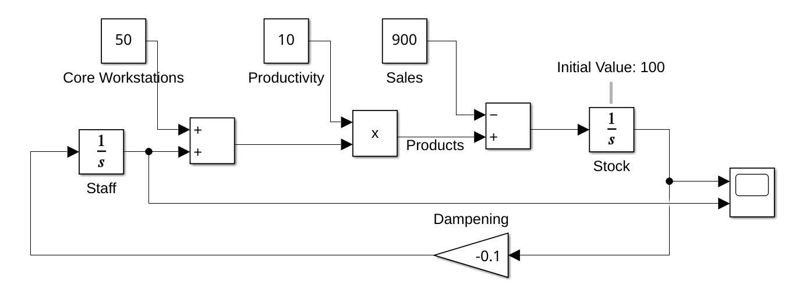
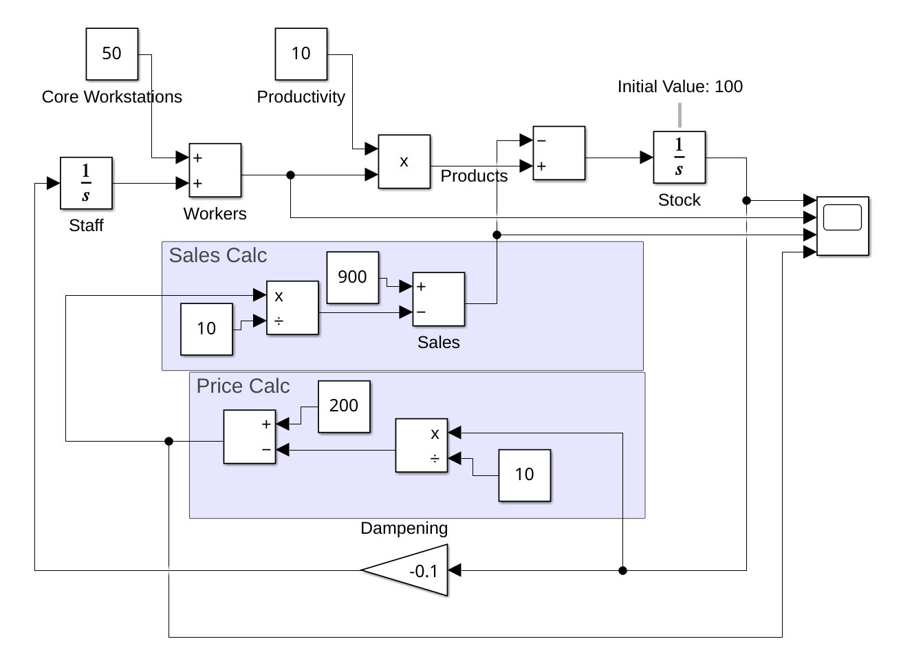
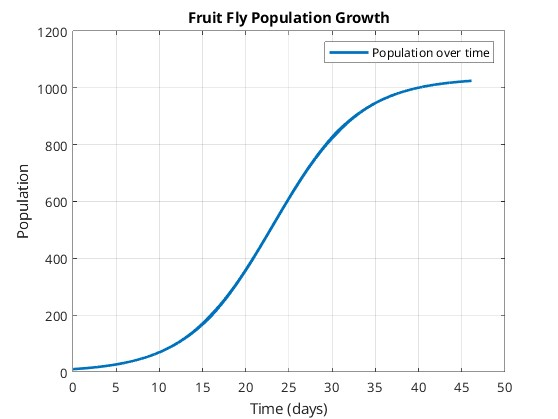
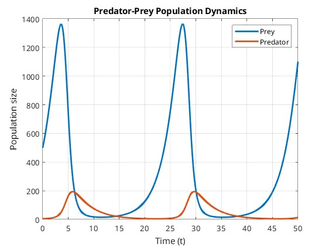
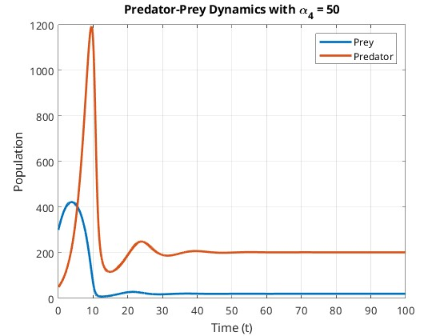
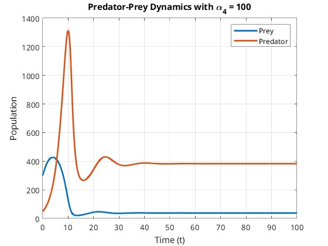
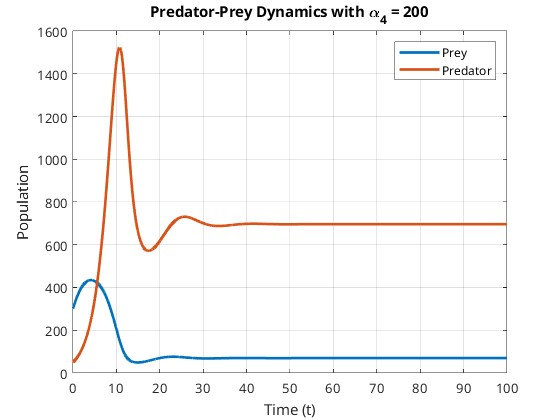

# Übung 05
## Task 1
### a)
Simulate (in SIMULINK) the control of the hiring & firing of workers depending on the stock level of a production environment. Initially assume a steady sales of 900 units, a productivity of 10 units per worker, a base of 50 core workstations, and an initial stock level of 100 stock units.
Document your model and corresponding test results - does this system converge? 



### b)
Introduce a damping constant into the model (with coefficient 0.1). How does this change your model and how does it affect the simulation? 



Das Modell aus Aufgabe a) wurde mit einer Dämpfungskonstanten erweitert, welche das Personal und den Lagerstand in Schwingung versetzt. Dabei kann die Abhängigkeit der beiden Variablen beobachtet werden. Erreicht der Lagerstand den Nullpunkt, ist das Maximum an Angestellten erreicht. Bewegt sich der Lagerstand weiter unter Null wird Personal aufgebaut. Diese Variablen konvergieren ebenfalls nicht. Ein Lagerstand unter 0 könnte als offene Aufträge interpretiert werden.

### c)
Let us now assume that the price is calculated as (200 – stock level / 10). Additionally assume that the sales depend on the price, so that the sales are calculated as (900 – price / 10). Again, document your model and the resulting simulations.



## Task 2
The proliferation of the fruit fly was experimentally investigated by R. Pearl in 1920 and the following equation for
the population P (t) (t measured in days) was found:
P'(t) = (1/5) P(t) - (1/5175)P2
(t).
How big is the population after 12 days, if there are initially 10 fruit flies?
How many individuals are there eventually in the population?
Draw the progress of the population size until that day where 99% of the maximum value are reached. 
```matlab
function population_flies()
    % Parameters
    a = 1/5;           % Growth rate (alpha)
    b = 1/5175;        % Capacity parameter (beta)
    x0 = 10;           % Initial population
    t_s = 0.01;        % Time step size
    t_max = 100;       % Maximum observation time
    threshold = 0.99;  % 99% of the maximum population

    % Initialization
    t = 0:t_s:t_max;   % Time vector
    P = zeros(length(t), 1); % Population array
    P(1) = x0;         % Set initial population

    % Euler
    for i = 1:length(t)-1
        P_ = a * P(i) - b * P(i)^2; % Compute population derivative
        P(i+1) = P(i) + t_s * P_;   % Update population using Euler step

        % Stop when 99% of the maximum population is reached
        P_max = a / b;  % Analytical maximum population
        if P(i+1) >= threshold * P_max
            t = t(1:i+1); % Trim time vector
            P = P(1:i+1); % Trim population vector
            break;
        end
    end

    % Display results
    fprintf('Population after 12 days: %.2f\n', P(round(12/t_s)));
    fprintf('Asymptotic population size: %.2f\n', a / b);

    % Plot the population growth
    plot(t, P, 'LineWidth', 2);
    xlabel('Time (days)');
    ylabel('Population');
    title('Fruit Fly Population Growth');
    grid on;
    legend('Population over time');
end
```

```
Population after 12 days: 100.12
Asymptotic population size: 1035.00
```



## Task 3

### a)
For a typical predator – prey scenario let us assume:
- Grow constant and average number of preys: 0.4 and 300 resp.
- Loss rate and average number of predators: 0.3 and 50, resp.

 Calculate the course of the predator and prey population starting with R0 = 5 and B0 = 500. 
```matlab
function predator_prey(b0, r0, alpha, beta, gamma, delta, t_s, t_max)
    % Default parameters
    if nargin == 0
        alpha = 0.4;   % Growth rate of prey
        beta = 0.008;  % Interaction coefficient prey-predator
        gamma = 0.3;   % Loss rate of predators
        delta = 0.001; % Growth rate of predators from prey
        b0 = 500;      % Initial prey population
        r0 = 5;        % Initial predator population
        t_s = 0.001;   % Time step size
        t_max = 50;    % Maximum simulation time
    end

    % Initialization
    t = 0:t_s:t_max;
    n_steps = length(t);
    b_prog = zeros(n_steps, 1);
    r_prog = zeros(n_steps, 1);
    b = b0;
    r = r0;

    % Euler
    for i = 1:n_steps
        b_ = alpha * b - beta * b * r;   % Change in prey
        r_ = -gamma * r + delta * b * r; % Change in predator
        b = b + b_ * t_s;                % Update prey population
        r = r + r_ * t_s;                % Update predator population
        b_prog(i) = b;                   % Save prey population
        r_prog(i) = r;                   % Save predator population
    end

    % Plot the results
    plot(t, b_prog, 'LineWidth', 2);
    hold on;
    plot(t, r_prog, 'LineWidth', 2);
    xlabel('Time (t)');
    ylabel('Population size');
    title('Predator-Prey Population Dynamics');
    legend('Prey', 'Predator');
    grid on;
    hold off;
end
```




### b)
Using the following predator-prey model with limit cycles:

$\frac{db(t)}{dt}=b(t)*(\alpha_1*(1- \frac{b(t)}{\alpha_2})- \frac{\alpha_3*r(t)}{b(t)+\alpha_4})$

$\frac{dr(t)}{dt}=r(t)*\alpha_5*(1-\frac{\alpha_6 * r(t)}{b(t)})$

Where:
- $b(t)$: prey population at time $t$
- $r(t)$: predator population at time $t$
- $\alpha_1= 0.6$, $\alpha_2=500$, $\alpha_3= 0.2$, $\alpha_4= 100$, $\alpha_5= 0.4$, $\alpha_6= 0.1$

1. Simulate the dynamics of $b(t)$ and $r(t)$ over time for the initial conditions $b(0)=300$, $r(0)=50$. Plot their
trajectories over time.
2. Analyze the effect of $\alpha_4$ on the predator-prey interaction by varying its value (e.g., 50,100,200). How does
it influence the stability or equilibrium of the populations?
3. Discuss the meaning of the saturation terms for both predator and prey (e.g., $\frac{\alpha_3*r(t)}{b(t)+\alpha_4}$), and how they alter
the dynamics compared to simpler models like Lotka-Volterra. 


```matlab
function predator_prey_limit(alpha4_values)
    % Parameters
    alpha1 = 0.6; % Prey growth rate
    alpha2 = 500; % Prey capacity
    alpha3 = 0.2; % Predation rate
    alpha5 = 0.4; % Predator growth rate
    alpha6 = 0.1; % Predator saturation parameter
    b0 = 300;     % Initial prey population
    r0 = 50;      % Initial predator population
    t_s = 0.01;   % Time step
    t_max = 100;  % Total simulation time

    % Time vector
    t = 0:t_s:t_max;
    n_steps = length(t);
    
    % Loop through different alpha4 values
    for alpha4 = alpha4_values
        % Initialize populations
        b = b0;
        r = r0;
        b_progress = zeros(n_steps, 1);
        r_progress = zeros(n_steps, 1);
        
        % Euler
        for i = 1:n_steps
            db_dt = b * (alpha1 * (1 - b / alpha2) - (alpha3 * r) / (b + alpha4));
            dr_dt = r * alpha5 * (1 - (alpha6 * r) / b);
            b = b + db_dt * t_s;
            r = r + dr_dt * t_s;
            b_progress(i) = b;
            r_progress(i) = r;
        end
        
        % Plot results
        figure;
        plot(t, b_progress, 'LineWidth', 2);
        hold on;
        plot(t, r_progress, 'LineWidth', 2);
        xlabel('Time (t)');
        ylabel('Population');
        title(['Predator-Prey Dynamics with \alpha_4 = ', num2str(alpha4)]);
        legend('Prey', 'Predator');
        grid on;
        hold off;
    end
end
```
Aufruf mit
```
predator_prey_limit([50, 100, 200]);
```





