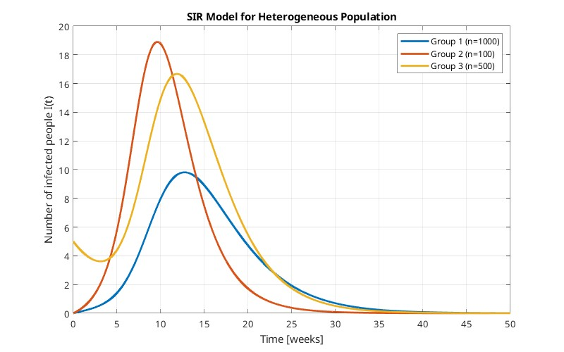

# Übung 05

## Task 1
Assume a disease for which we can model its spread in a population by a logistic model. Calculate
the progress of the disease for N = 10000 and k = 10, 20, 30, 50; produce a time diagram in which all
progresses for all scenarios are shown.

### Lösungsidee
Anwendung der Verhulst-Gleichung:
$x^t=\alpha x(t) - \beta x(t)^2$

$\alpha$ ... Wachstumsrate (Kontakte mit infizierten Personen) \
$\beta$ ... Rückgang der Infektion \
$\alpha$ wird zu $k$ und $\beta$ zu $\frac{k}{N}$

$I' = kI-\frac{k}{N}I^2$ 

### Implementierung

Berechnungs-Funktion
```matlab
function I = simulate_spread(N, k, t, dt)
    I = zeros(size(t));
    I(1) = 1;  % Initial condition: one infected person
    
    for i = 1:length(t)-1
        dI = k * I(i) * (1 - I(i)/N);
        I(i+1) = I(i) + dI * dt;
    end
end
```

Aufruf mit verschiedenden $k$-Werten
```matlab
function task_1(N, k_values, t_max, dt)
    % Default parameters if not provided
    if nargin < 1, N = 10000; end
    if nargin < 2, k_values = [10, 20, 30, 50]; end
    if nargin < 3, t_max = 3; end
    if nargin < 4, dt = 0.001; end
    
    t = 0:dt:t_max;
    figure;
    hold on;
    
    for k = k_values
        I = simulate_spread(N, k, t, dt);
        plot(t, I, 'LineWidth', 1.5);
    end
    
    xlabel('Time (days)');
    ylabel('Number of infected people');
    title('Disease Spread in Population');
    legend(arrayfun(@(k) sprintf('k = %d', k), k_values, 'UniformOutput', false));
    grid on;
    hold off;
end
```
### Aufruf

```
task_1()
```


## Task 2
>... skipped (for now :D)...

## Task 3

### a) Assume that the basic reproduction number of a measles epidemic is R0 = 7.5, and that the average infectious period of a patient lasts 10 days. Calculate the progress of the epidemic using the standard SIR model without births and deaths.

### Lösungsidee
... wow so much empty ...

### Implementierung
```matlab
function task_3a(N)
   % Model parameters
   if nargin < 1, N = 100;  end
   % Population size
   beta = 0.1;     % Recovery rate (1/10 days)
   R0 = 7.5;       % Basic reproduction number
   alpha = R0 * beta;  % Infection rate
   tMax = 30;      % Simulation time
   dt = 0.01;      % Time step

   % Initial conditions
   S = N - 1;
   I = 1;
   R = 0;

   % Arrays for storing results
   steps = tMax/dt;
   Sprogress = zeros(steps, 1);  
   Iprogress = zeros(steps, 1);
   Rprogress = zeros(steps, 1);
   time = zeros(steps, 1);

   % Simulate using Euler method
   for i = 1:steps
       % Store current state
       Sprogress(i) = S;
       Iprogress(i) = I;
       Rprogress(i) = R;
       time(i) = (i-1)*dt;

       % Calculate derivatives
       dSdt = -alpha * S * I / N;
       dIdt = alpha * S * I / N - beta * I;
       dRdt = beta * I;

       % Update using Euler step
       S = S + dSdt * dt;
       I = I + dIdt * dt;
       R = R + dRdt * dt;
   end

   % Plot time evolution
   figure(1);
   plot(time, [Sprogress Iprogress Rprogress]);
   legend('Susceptible', 'Infected', 'Recovered');
   xlabel('Time (days)');
   ylabel('Population');
   title('SIR Model Time Evolution');
   grid on;

   % Plot phase portrait
   figure(2);
   plot(Sprogress, Iprogress);
   xlabel('Susceptible Population');
   ylabel('Infected Population');
   title('Phase Portrait (S-I)');
   grid on;
end
```

### Aufruf

```
task_3a(100)
```


```
task_3a(1000)
```


```
task_3a(10000)
```


### b) Calculate the progress of S, I and R for the scenario (a) assuming a birth rate μ = 0.0003. What is the eventual number of diseased persons for t → ∞? Furthermore, calculate p_crit as well as the progress of I(t) assuming an inoculation rate of exactly p_crit.


### Lösungsidee
... wow so much empty ...

### Implementierung

```matlab
function task_3b(N)
   % Model parameters
   if nargin < 1, N = 1000; end
   beta = 0.1;         % Recovery rate (1/10 days)
   R0 = 7.5;          % Basic reproduction number
   alpha = R0 * beta;  % Infection rate
   mu = 0.0003;       % Birth/death rate
   pcrit = 1 - 1/R0;  % Critical vaccination rate
   tMax = 100;        % Simulation time in weeks
   dt = 0.01;         % Time step

   % Initial conditions
   % No vaccination
   S1 = N - 1;
   I1 = 1;
   R1 = 0;
   % With vaccination
   S2 = N - 1;
   I2 = 1;
   R2 = 0;  

   % Arrays for storing results
   steps = tMax/dt;
   S1_prog = zeros(steps, 1);
   I1_prog = zeros(steps, 1);
   R1_prog = zeros(steps, 1);

   S2_prog = zeros(steps, 1);
   I2_prog = zeros(steps, 1);
   R2_prog = zeros(steps, 1);
   time = zeros(steps, 1);

   % Simulate using Euler method
   for i = 1:steps
       % Store current state
       S1_prog(i) = S1; I1_prog(i) = I1; R1_prog(i) = R1;
       S2_prog(i) = S2; I2_prog(i) = I2; R2_prog(i) = R2;
       time(i) = (i-1)*dt;

       % No vaccination
       dS1 = -alpha*S1*I1/N - mu*S1 + mu*N;
       dI1 = alpha*S1*I1/N - beta*I1 - mu*I1;
       dR1 = beta*I1 - mu*R1;

       % With vaccination
       dS2 = -alpha*S2*I2/N - mu*S2 + mu*N*(1-pcrit);
       dI2 = alpha*S2*I2/N - beta*I2 - mu*I2;
       dR2 = beta*I2 - mu*R2 + mu*N*pcrit;

       % Update using Euler step
       S1 = S1 + dS1*dt; I1 = I1 + dI1*dt; R1 = R1 + dR1*dt;
       S2 = S2 + dS2*dt; I2 = I2 + dI2*dt; R2 = R2 + dR2*dt;
   end

   % Plot time evolution
   figure(1);
   subplot(2,1,1);
   plot(time, [S1_prog I1_prog R1_prog]);
   title('SIR with Demographics (No Vaccination)');
   legend('S', 'I', 'R');
   xlabel('Time (weeks)');
   ylabel('Population');
   grid on;

   subplot(2,1,2);
   plot(time, [S2_prog I2_prog R2_prog]);
   title(['SIR with Demographics (p = ' num2str(pcrit) ')']);
   legend('S', 'I', 'R');
   xlabel('Time (weeks)');
   ylabel('Population');
   grid on;

   % Plot phase portraits
   figure(2);
   subplot(2,1,1);
   plot(S1_prog, I1_prog);
   title('Phase Portrait (No Vaccination)');
   xlabel('Susceptible');
   ylabel('Infected');
   grid on;

   subplot(2,1,2);
   plot(S2_prog, I2_prog);
   title(['Phase Portrait (p = ' num2str(pcrit) ')']);
   xlabel('Susceptible');
   ylabel('Infected');
   grid on;
end
```

### Aufruf

```
task_3b()
```


## Task 4

Let us assume three groups in a population with one „core group“:
- Group 1: n = 1000, 2 contacts / week, contact ratios: 0.9, 0.05, 0.05
- Group 2: n = 100, 10 contacts / week, contact ratios: 0.1, 0.7, 0.2 
- Group 3: n = 500, 4 contacts / week, contact ratios: 0.05, 0.1, 0.85

 Infection probability at contact: 15% \
 An infectious period lasts for 2 weeks for groups 1 and 2, 1.5 weeks for group 3\
Calculate the progress of the infections in the groups 1 - 3, assuming that there are initially 5 diseased persons in group 3.

### Lösungsidee
... nuffin :D ...

### Ausarbeitung
$k$ ... Kontakte pro Woche \
$d$ ... Wochen bis zur Genesung

- Gruppe 1: \
$\alpha_1 = qk_1 = 0.15*2 = 0.3$ \
$\beta_1 = \frac{1}{d_1} = \frac{1}{2} = 0.5$

- Gruppe 2: \
$\alpha_2 = qk_2 = 0.15*10 = 1.5$ \
$\beta_2 = \frac{1}{d_2} = \frac{1}{2} = 0.5$

- Gruppe 3: \
$\alpha_3 = qk_3 = 0.15*4 = 0.6$ \
$\beta_3 = \frac{1}{d_3} = \frac{1}{1.5} = 0.\dot6$

Folgende Mixture-Matrix kann aufgestellt werden \
$M = \begin{bmatrix}
0.9 & 0.05 & 0.05 \\
0.1 & 0.7 & 0.2 \\
0.3 & 0.3 & 0.4 
\end{bmatrix}$

### Implementierung
```matlab
function task_4()
    % Simulation parameters
    tMax = 50;
    tStep = 0.01;
    timePoints = 0:tStep:tMax;
    
    % Population parameters
    N = [1000, 100, 500];  % Population sizes
    contacts = [2, 10, 4];  % Contacts per week
    infectionProb = 0.15;   % Infection probability at contact
    recoveryTime = [2, 2, 1.5];  % Weeks until recovery
    
    % Contact matrix
    M = [0.9, 0.05, 0.05;
         0.1, 0.7,  0.2;
         0.3, 0.3,  0.4];
    
    % Calculate alpha and beta for each group
    alpha = contacts * infectionProb;
    beta = 1 ./ recoveryTime;
    
    % Initialize state variables
    S = zeros(length(timePoints), 3);
    I = zeros(length(timePoints), 3);
    R = zeros(length(timePoints), 3);
    
    % Initial conditions
    S(1,:) = N;
    I(1,:) = [0, 0, 5];  % 5 initial infected in group 3
    S(1,:) = S(1,:) - I(1,:);
    R(1,:) = zeros(1,3);
    
    % Time integration using Euler method
    for t = 1:length(timePoints)-1
        for i = 1:3
            % Calculate infection term
            infectionTerm = 0;
            for j = 1:3
                infectionTerm = infectionTerm + M(i,j) * I(t,j) / N(j);
            end
            
            % Calculate derivatives
            dS = -alpha(i) * S(t,i) * infectionTerm;
            dI = alpha(i) * S(t,i) * infectionTerm - beta(i) * I(t,i);
            dR = beta(i) * I(t,i);
            
            % Euler step
            S(t+1,i) = S(t,i) + dS * tStep;
            I(t+1,i) = I(t,i) + dI * tStep;
            R(t+1,i) = R(t,i) + dR * tStep;
        end
    end
    
    % Plotting
    figure('Position', [100, 100, 800, 500]);
    plot(timePoints, I(:,1), 'LineWidth', 2);
    hold on;
    plot(timePoints, I(:,2), 'LineWidth', 2);
    plot(timePoints, I(:,3), 'LineWidth', 2);
    grid on;
    xlabel('Time [weeks]');
    ylabel('Number of infected people I(t)');
    title('SIR Model for Heterogeneous Population');
    legend('Group 1 (n=1000)', 'Group 2 (n=100)', 'Group 3 (n=500)');
end
```

### Aufruf
```
task_4()
```

