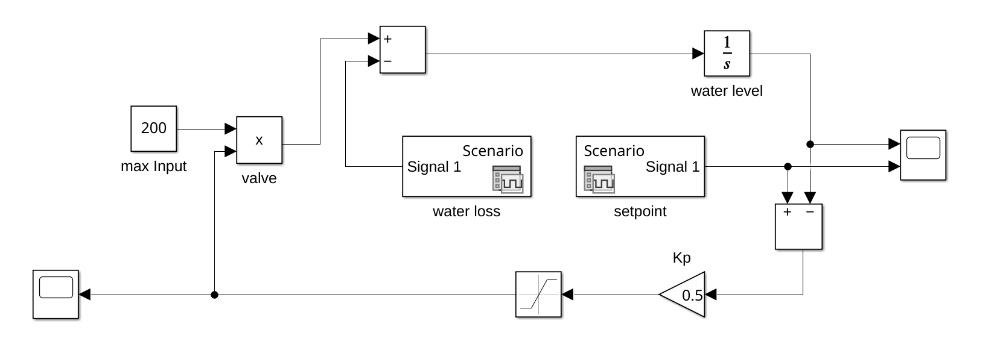

# Übung 07

## **Aufgabe 1** SIR models and model identification

Implement a parameter identification algorithm for SIR models and identify a concrete SIR model for the disease defined in the lecture slides. Especially evolution strategies should be perfect for this task. Document which parameter settings work well, and which ones lead to failures; choose various $\mu +\lambda$ / $\mu, \lambda$ strategies with / without
adaptation of mutation strength.

### Lösungsidee

### Implementierung

Optimierungs-Funktion
```matlab
function [bestAlpha, bestBeta, bestFitness, alphaProgress, betaProgress] = ...
    optimizeParametersAdvanced(alphaMax, betaMax, strategy, mu, lambda, adaptMutation, maxRounds, initialSigma)
    
    % default values
    if nargin < 3
        strategy = 'plus';  % 'plus' for (μ+λ) or 'comma' for (μ,λ)
    end
    if nargin < 4
        mu = 1;  % number of parents
    end
    if nargin < 5
        lambda = 50;  % number of offspring
    end
    if nargin < 6
        adaptMutation = true;  % adapt mutation strength or not
    end
    if nargin < 7
        maxRounds = 1000;  % maximum number of generations
    end
    if nargin < 8
        initialSigma = 1.0;  % initial mutation strength
    end
    
    % Initialize parent population
    parents = zeros(mu, 4); % [alpha, beta, fitness, sigma]
    for i = 1:mu
        alpha = rand * alphaMax;
        beta = rand * betaMax;
        fitness = evaluateReindeerOutbreak(alpha, beta, false);
        parents(i,:) = [alpha, beta, fitness, initialSigma];
    end

    % ascending sort parents by fitness 
    parents = sortrows(parents, 3);
    bestFitness = parents(1,3);
    
    % init progress
    alphaProgress = zeros(1, maxRounds);
    betaProgress = zeros(1, maxRounds);

    % evolution
    for round = 1:maxRounds
        % store current best
        alphaProgress(round) = parents(1,1);
        betaProgress(round) = parents(1,2);
        
        % generate lambda offspring with random mutations
        offspring = zeros(lambda, 4);
        for i = 1:lambda
            % select random parent
            parentIdx = randi(mu);
            parentSigma = parents(parentIdx,4);
            
            newAlpha = parents(parentIdx,1) + randn * parentSigma;
            newBeta = parents(parentIdx,2) + randn * parentSigma;
            newFitness = evaluateReindeerOutbreak(newAlpha, newBeta, false);
            
            % Adapt mutation strength if enabled
            if adaptMutation
                newSigma = parentSigma * exp(randn * 0.1);
                newSigma = max(0.01, min(2.0, newSigma)); % Bound sigma
            else
                newSigma = parentSigma;
            end
            
            offspring(i,:) = [newAlpha, newBeta, newFitness, newSigma];
        end

        % Selection based on selected strategy
        if strcmp(strategy, 'plus')
            % (μ+λ) strategy: select from both parents and offspring
            combined = [parents; offspring];
            sorted = sortrows(combined, 3); % Sort by fitness
            parents = sorted(1:mu,:);
        else
            % (μ,λ) strategy: select only from offspring
            sorted = sortrows(offspring, 3);
            parents = sorted(1:mu,:);
        end
        
        % assign new best fitness
        if parents(1,3) < bestFitness
            bestFitness = parents(1,3);
        end
        
        % stop if mutation size is too small (4th col is sigma)
        if all(parents(:,4) < 0.01) 
            break;
        end
    end
    
    % return optimal parameters
    bestAlpha = parents(1,1);
    bestBeta = parents(1,2);
end
```

Evaluierungs-Funktion (übernommen aus der gemeinsamen Übung)
```matlab
function fitness = evaluateReindeerOutbreak(alpha, beta, plotIt)
    if nargin < 3
        plotIt = false;
    end
    timeStep = 0.01;
    maxTime = 14;

    % observed data
    days = 0:14;
    observedInfected = [1, 5, 10, 30, 90, 220, 280, 240, 230, 190, 130, 80, 55, 15, 4];
    N = 500;

    S = N - 1;
    I = 1;
    R = 0;

    Sprogress = zeros(maxTime/timeStep + 1, 1);
    Iprogress = zeros(maxTime/timeStep + 1, 1);
    Rprogress = zeros(maxTime/timeStep + 1, 1);
    tprogress = zeros(maxTime/timeStep + 1, 1);

    i = 1;
    for t = 0:timeStep:maxTime
        
        Sprogress(i) = S;
        Iprogress(i) = I;
        Rprogress(i) = R;
        tprogress(i) = t;

        dS = -alpha * S * I/N;
        dI = alpha * S * I/N - beta * I;
        dR = beta * I;

        S = S + dS * timeStep;
        I = I + dI * timeStep;
        R = R + dR * timeStep;

        i = i + 1;
    end
    
    % evaluate result
    fitness = 0;
    simulatedInfected = interp1(0:timeStep:maxTime, Iprogress, days);
    for i = 1:length(days)
        fitness = fitness + (simulatedInfected(i) - observedInfected(i))^2;
    end

    if plotIt
        figure;
        plot(tprogress, Iprogress, 'b');
        hold on;
        scatter(days, observedInfected, 'r', 'filled');
        xlabel('Days');
        ylabel('Number of infected reindeer');
        title('Reindeer Cough Outbreak');
        legend('Simulated', 'Observed');
        hold off;
    end

end
```

Hilfsfunktion zum Plotten (übernommen aus der gemeinsamen Übung)
```matlab
function plotFitnessLandscapeWithProgress(alpha, beta, alphaProgress, betaProgress)
    fitnessGrid = zeros(length(alpha), length(beta));
    xGrid = zeros(size(fitnessGrid));
    yGrid = zeros(size(fitnessGrid));

    for a = 1:length(alpha)
        for b = 1:length(beta)
            fitnessGrid(b, a) = log(evaluateReindeerOutbreak(alpha(a), beta(b), false));
            xGrid(b, a) = alpha(a);
            yGrid(b, a) = beta(b);
        end
    end

    figure;
    pcolor(xGrid, yGrid, fitnessGrid);
    shading interp;
    xlabel('Infectionrate');
    ylabel('Recoveryrate');

    title('Fitnesslandscape');
    colorbar;
    hold on;

    plot(alphaProgress, betaProgress, 'r');
    hold off;
end
```


### Aufruf
(als Matlab-LiveScript)

```matlab
alphaMax = 3;
betaMax = 3;

% we need that for plots (no other purpose)
alphaStep = 0.1;
betaStep = 0.1;
alpha = 0:alphaStep:alphaMax;
beta = 0:betaStep:betaMax;
```
```matlab
fprintf('function from the lecture');
[bestAlpha, bestBeta, bestFitness, alphaProgress, betaProgress] = optimizeParameters(alphaMax, betaMax);
plotFitnessLandscapeWithProgress(alpha, beta, alphaProgress, betaProgress);
evaluateReindeerOutbreak(bestAlpha, bestBeta, true);
fprintf('best fitness: %f\n', bestFitness);

fprintf('(1+50)-ES with mutation-adaption');
[bestAlpha, bestBeta, bestFitness, alphaProgress, betaProgress] = optimizeParametersAdvanced(alphaMax, betaMax);
plotFitnessLandscapeWithProgress(alpha, beta, alphaProgress, betaProgress);
evaluateReindeerOutbreak(bestAlpha, bestBeta, true);
fprintf('best fitness: %f\n', bestFitness);

fprintf('(1,50)-ES without mutation-adaption');
[bestAlpha, bestBeta, bestFitness, alphaProgress, betaProgress] = optimizeParametersAdvanced(alphaMax, betaMax,  'comma', 1, 50, false);
plotFitnessLandscapeWithProgress(alpha, beta, alphaProgress, betaProgress);
evaluateReindeerOutbreak(bestAlpha, bestBeta, true);
fprintf('best fitness: %f\n', bestFitness);

fprintf('(5+30)-ES with mutation-adaption');
[bestAlpha, bestBeta, bestFitness, alphaProgress, betaProgress] = optimizeParametersAdvanced(alphaMax, betaMax, 'plus', 5, 30, true, 500, 0.5);
plotFitnessLandscapeWithProgress(alpha, beta, alphaProgress, betaProgress);
evaluateReindeerOutbreak(bestAlpha, bestBeta, true);
fprintf('best fitness: %f\n', bestFitness);
```

### Ausgabe

```
function from the lecture
```


```
best fitness: 6880.981981
```
```
(1+50)-ES with mutation-adaption
```


```
best fitness: 6896.179022
```
```
(1,50)-ES without mutation-adaption
```


```
best fitness: 6918.655194
```
```
(5+30)-ES with mutation-adaption
```


```
best fitness: 6883.870593
```

### Tests mit verschiedenen Parametern

```
Test                                               | Alpha  | Beta   | Fitness  | Mu    | Sigma     
------------------------------------------------------------------------------------------
(1 plus 1)-ES, sigma=0.3                           |  1.577 |  0.301 | 7720.6651 |     1 |      0.300
(1 plus 1)-ES, sigma=0.7                           |  1.568 |  0.290 | 7040.7654 |     1 |      0.700
(1 plus 1)-ES, sigma=1.0                           |  1.558 |  0.270 | 7238.3901 |     1 |      1.000
(1 comma 1)-ES, sigma=0.3                          |  4.724 |  0.783 | 88722.3182 |     1 |      0.300
(1 comma 1)-ES, sigma=0.7                          |  3.926 |  2.872 | 63076.1705 |     1 |      0.700
(1 comma 1)-ES, sigma=1.0                          |  3.719 |  3.201 | 88967.7626 |     1 |      1.000
(1 plus 3)-ES, sigma=0.3                           |  1.552 |  0.281 | 6975.5236 |     1 |      0.300
(1 plus 3)-ES, sigma=0.7                           |  1.564 |  0.287 | 6965.4435 |     1 |      0.700
(1 plus 3)-ES, sigma=1.0                           |  1.554 |  0.281 | 6959.9712 |     1 |      1.000
(1 comma 3)-ES, sigma=0.3                          |  1.613 |  0.397 | 6881.5720 |     1 |      0.300
(1 comma 3)-ES, sigma=0.7                          |  5.000 |  2.826 | 7150.8372 |     1 |      0.700
(1 comma 3)-ES, sigma=1.0                          |  1.616 |  0.275 | 6893.5504 |     1 |      1.000
(1 plus 7)-ES, sigma=0.3                           |  1.571 |  0.279 | 6894.3637 |     1 |      0.300
(1 plus 7)-ES, sigma=0.7                           |  1.575 |  0.273 | 7078.7727 |     1 |      0.700
(1 plus 7)-ES, sigma=1.0                           |  1.560 |  0.283 | 6918.3172 |     1 |      1.000
(1 comma 7)-ES, sigma=0.3                          |  1.595 |  0.282 | 6881.0601 |     1 |      0.300
(1 comma 7)-ES, sigma=0.7                          |  1.571 |  0.253 | 6883.5128 |     1 |      0.700
(1 comma 7)-ES, sigma=1.0                          |  1.575 |  0.227 | 6890.2176 |     1 |      1.000
(1 plus 10)-ES, sigma=0.3                          |  1.572 |  0.280 | 6891.3193 |     1 |      0.300
(1 plus 10)-ES, sigma=0.7                          |  1.568 |  0.282 | 6882.8634 |     1 |      0.700
(1 plus 10)-ES, sigma=1.0                          |  1.567 |  0.275 | 6967.1981 |     1 |      1.000
(1 comma 10)-ES, sigma=0.3                         |  1.489 |  0.493 | 6882.3187 |     1 |      0.300
(1 comma 10)-ES, sigma=0.7                         |  1.569 |  0.283 | 6881.0785 |     1 |      0.700
(1 comma 10)-ES, sigma=1.0                         |  1.643 |  0.285 | 6885.8172 |     1 |      1.000
(3 plus 3)-ES, sigma=0.3                           |  1.570 |  0.282 | 6883.9534 |     3 |      0.300
(3 plus 3)-ES, sigma=0.7                           |  1.554 |  0.286 | 7015.1947 |     3 |      0.700
(3 plus 3)-ES, sigma=1.0                           |  1.539 |  0.287 | 7351.3723 |     3 |      1.000
(3 comma 3)-ES, sigma=0.3                          |  1.715 |  0.239 | 12873.6053 |     3 |      0.300
(3 comma 3)-ES, sigma=0.7                          |  4.046 |  2.029 | 10982.8926 |     3 |      0.700
(3 comma 3)-ES, sigma=1.0                          |  2.600 |  1.845 | 11841.6133 |     3 |      1.000
(3 plus 9)-ES, sigma=0.3                           |  1.569 |  0.284 | 6898.7772 |     3 |      0.300
(3 plus 9)-ES, sigma=0.7                           |  1.584 |  0.282 | 6976.7884 |     3 |      0.700
(3 plus 9)-ES, sigma=1.0                           |  1.583 |  0.263 | 7939.9099 |     3 |      1.000
(3 comma 9)-ES, sigma=0.3                          |  1.564 |  0.280 | 6881.0298 |     3 |      0.300
(3 comma 9)-ES, sigma=0.7                          |  1.570 |  0.279 | 6881.0033 |     3 |      0.700
(3 comma 9)-ES, sigma=1.0                          |  1.568 |  0.285 | 6881.0879 |     3 |      1.000
(3 plus 21)-ES, sigma=0.3                          |  1.566 |  0.282 | 6882.2650 |     3 |      0.300
(3 plus 21)-ES, sigma=0.7                          |  1.574 |  0.281 | 6899.4747 |     3 |      0.700
(3 plus 21)-ES, sigma=1.0                          |  1.558 |  0.283 | 6924.9179 |     3 |      1.000
(3 comma 21)-ES, sigma=0.3                         |  1.575 |  0.286 | 6880.9837 |     3 |      0.300
(3 comma 21)-ES, sigma=0.7                         |  1.574 |  0.281 | 6880.9868 |     3 |      0.700
(3 comma 21)-ES, sigma=1.0                         |  1.572 |  0.290 | 6881.0104 |     3 |      1.000
(3 plus 30)-ES, sigma=0.3                          |  1.568 |  0.282 | 6881.0629 |     3 |      0.300
(3 plus 30)-ES, sigma=0.7                          |  1.574 |  0.285 | 6916.8332 |     3 |      0.700
(3 plus 30)-ES, sigma=1.0                          |  1.560 |  0.285 | 6942.7052 |     3 |      1.000
(3 comma 30)-ES, sigma=0.3                         |  1.574 |  0.285 | 6880.9850 |     3 |      0.300
(3 comma 30)-ES, sigma=0.7                         |  1.569 |  0.283 | 6880.9879 |     3 |      0.700
(3 comma 30)-ES, sigma=1.0                         |  1.572 |  0.282 | 6880.9845 |     3 |      1.000
(7 plus 7)-ES, sigma=0.3                           |  1.566 |  0.280 | 6884.5322 |     7 |      0.300
(7 plus 7)-ES, sigma=0.7                           |  1.576 |  0.284 | 6919.5251 |     7 |      0.700
(7 plus 7)-ES, sigma=1.0                           |  1.577 |  0.276 | 7003.6952 |     7 |      1.000
(7 comma 7)-ES, sigma=0.3                          |  0.470 |  2.763 | 11586.1856 |     7 |      0.300
(7 comma 7)-ES, sigma=0.7                          |  5.000 |  3.227 | 8203.7982 |     7 |      0.700
(7 comma 7)-ES, sigma=1.0                          |  0.747 |  4.611 | 50111.4890 |     7 |      1.000
(7 plus 21)-ES, sigma=0.3                          |  1.567 |  0.282 | 6881.1531 |     7 |      0.300
(7 plus 21)-ES, sigma=0.7                          |  1.566 |  0.282 | 6882.6217 |     7 |      0.700
(7 plus 21)-ES, sigma=1.0                          |  1.551 |  0.282 | 6998.7530 |     7 |      1.000
(7 comma 21)-ES, sigma=0.3                         |  1.571 |  0.283 | 6881.0059 |     7 |      0.300
(7 comma 21)-ES, sigma=0.7                         |  1.565 |  0.283 | 6880.9933 |     7 |      0.700
(7 comma 21)-ES, sigma=1.0                         |  1.575 |  0.278 | 6880.9838 |     7 |      1.000
(7 plus 49)-ES, sigma=0.3                          |  1.571 |  0.282 | 6885.0548 |     7 |      0.300
(7 plus 49)-ES, sigma=0.7                          |  1.571 |  0.281 | 6884.2331 |     7 |      0.700
(7 plus 49)-ES, sigma=1.0                          |  1.567 |  0.279 | 6889.9434 |     7 |      1.000
(7 comma 49)-ES, sigma=0.3                         |  1.569 |  0.281 | 6880.9845 |     7 |      0.300
(7 comma 49)-ES, sigma=0.7                         |  1.561 |  0.283 | 6880.9863 |     7 |      0.700
(7 comma 49)-ES, sigma=1.0                         |  1.570 |  0.281 | 6880.9849 |     7 |      1.000
(7 plus 70)-ES, sigma=0.3                          |  1.567 |  0.282 | 6882.3500 |     7 |      0.300
(7 plus 70)-ES, sigma=0.7                          |  1.563 |  0.282 | 6894.3853 |     7 |      0.700
(7 plus 70)-ES, sigma=1.0                          |  1.563 |  0.280 | 6896.8254 |     7 |      1.000
(7 comma 70)-ES, sigma=0.3                         |  1.569 |  0.282 | 6880.9910 |     7 |      0.300
(7 comma 70)-ES, sigma=0.7                         |  1.571 |  0.280 | 6880.9813 |     7 |      0.700
(7 comma 70)-ES, sigma=1.0                         |  1.568 |  0.281 | 6880.9878 |     7 |      1.000
(10 plus 10)-ES, sigma=0.3                         |  1.573 |  0.282 | 6892.4225 |    10 |      0.300
(10 plus 10)-ES, sigma=0.7                         |  1.573 |  0.282 | 6893.5682 |    10 |      0.700
(10 plus 10)-ES, sigma=1.0                         |  1.555 |  0.283 | 6953.3554 |    10 |      1.000
(10 comma 10)-ES, sigma=0.3                        |  4.744 |  3.712 | 9104.2507 |    10 |      0.300
(10 comma 10)-ES, sigma=0.7                        |  3.451 |  0.945 | 10907.7932 |    10 |      0.700
(10 comma 10)-ES, sigma=1.0                        |  2.816 |  0.765 | 9022.6593 |    10 |      1.000
(10 plus 30)-ES, sigma=0.3                         |  1.565 |  0.281 | 6884.3788 |    10 |      0.300
(10 plus 30)-ES, sigma=0.7                         |  1.568 |  0.280 | 6883.1406 |    10 |      0.700
(10 plus 30)-ES, sigma=1.0                         |  1.567 |  0.284 | 6894.0081 |    10 |      1.000
(10 comma 30)-ES, sigma=0.3                        |  1.574 |  0.282 | 6880.9919 |    10 |      0.300
(10 comma 30)-ES, sigma=0.7                        |  1.563 |  0.282 | 6881.0058 |    10 |      0.700
(10 comma 30)-ES, sigma=1.0                        |  1.572 |  0.284 | 6880.9871 |    10 |      1.000
(10 plus 70)-ES, sigma=0.3                         |  1.568 |  0.282 | 6882.4069 |    10 |      0.300
(10 plus 70)-ES, sigma=0.7                         |  1.559 |  0.278 | 6931.9005 |    10 |      0.700
(10 plus 70)-ES, sigma=1.0                         |  1.563 |  0.282 | 6890.7502 |    10 |      1.000
(10 comma 70)-ES, sigma=0.3                        |  1.569 |  0.281 | 6880.9834 |    10 |      0.300
(10 comma 70)-ES, sigma=0.7                        |  1.567 |  0.282 | 6880.9955 |    10 |      0.700
(10 comma 70)-ES, sigma=1.0                        |  1.573 |  0.280 | 6880.9820 |    10 |      1.000
(10 plus 100)-ES, sigma=0.3                        |  1.567 |  0.282 | 6881.1263 |    10 |      0.300
(10 plus 100)-ES, sigma=0.7                        |  1.570 |  0.282 | 6885.4017 |    10 |      0.700
(10 plus 100)-ES, sigma=1.0                        |  1.570 |  0.281 | 6883.2291 |    10 |      1.000
(10 comma 100)-ES, sigma=0.3                       |  1.568 |  0.281 | 6880.9817 |    10 |      0.300
(10 comma 100)-ES, sigma=0.7                       |  1.572 |  0.282 | 6880.9810 |    10 |      0.700
(10 comma 100)-ES, sigma=1.0                       |  1.568 |  0.280 | 6880.9824 |    10 |      1.000
(20 plus 20)-ES, sigma=0.3                         |  1.570 |  0.282 | 6882.5014 |    20 |      0.300
(20 plus 20)-ES, sigma=0.7                         |  1.581 |  0.282 | 6945.6800 |    20 |      0.700
(20 plus 20)-ES, sigma=1.0                         |  1.573 |  0.277 | 6949.0441 |    20 |      1.000
(20 comma 20)-ES, sigma=0.3                        |  1.277 |  0.580 | 9002.8469 |    20 |      0.300
(20 comma 20)-ES, sigma=0.7                        |  1.791 |  0.465 | 7004.7564 |    20 |      0.700
(20 comma 20)-ES, sigma=1.0                        |  2.488 |  0.546 | 7029.5928 |    20 |      1.000
(20 plus 60)-ES, sigma=0.3                         |  1.569 |  0.282 | 6881.2590 |    20 |      0.300
(20 plus 60)-ES, sigma=0.7                         |  1.560 |  0.281 | 6905.9821 |    20 |      0.700
(20 plus 60)-ES, sigma=1.0                         |  1.570 |  0.282 | 6885.4425 |    20 |      1.000
(20 comma 60)-ES, sigma=0.3                        |  1.571 |  0.282 | 6880.9828 |    20 |      0.300
(20 comma 60)-ES, sigma=0.7                        |  1.570 |  0.282 | 6880.9833 |    20 |      0.700
(20 comma 60)-ES, sigma=1.0                        |  1.567 |  0.284 | 6880.9913 |    20 |      1.000
(20 plus 140)-ES, sigma=0.3                        |  1.567 |  0.281 | 6881.1915 |    20 |      0.300
(20 plus 140)-ES, sigma=0.7                        |  1.568 |  0.282 | 6881.1451 |    20 |      0.700
(20 plus 140)-ES, sigma=1.0                        |  1.569 |  0.285 | 6907.7067 |    20 |      1.000
(20 comma 140)-ES, sigma=0.3                       |  1.569 |  0.281 | 6880.9847 |    20 |      0.300
(20 comma 140)-ES, sigma=0.7                       |  1.567 |  0.281 | 6880.9821 |    20 |      0.700
(20 comma 140)-ES, sigma=1.0                       |  1.566 |  0.282 | 6880.9812 |    20 |      1.000
(20 plus 200)-ES, sigma=0.3                        |  1.566 |  0.281 | 6883.0423 |    20 |      0.300
(20 plus 200)-ES, sigma=0.7                        |  1.570 |  0.281 | 6882.6082 |    20 |      0.700
(20 plus 200)-ES, sigma=1.0                        |  1.567 |  0.282 | 6883.9589 |    20 |      1.000
(20 comma 200)-ES, sigma=0.3                       |  1.568 |  0.282 | 6880.9810 |    20 |      0.300
(20 comma 200)-ES, sigma=0.7                       |  1.570 |  0.281 | 6880.9811 |    20 |      0.700
(20 comma 200)-ES, sigma=1.0                       |  1.567 |  0.282 | 6880.9823 |    20 |      1.000
(1plus10)-ES ohne Adapt, sigma=0.3                 |  1.562 |  0.279 | 6911.4538 |     1 |      0.300
(1plus10)-ES ohne Adapt, sigma=0.7                 |  1.543 |  0.275 | 7179.0611 |     1 |      0.700
(1comma10)-ES ohne Adapt, sigma=0.3                |  1.714 |  0.274 | 6884.4607 |     1 |      0.300
(1comma10)-ES ohne Adapt, sigma=0.7                |  1.697 |  0.193 | 7077.7606 |     1 |      0.700
(1plus15)-ES ohne Adapt, sigma=0.3                 |  1.570 |  0.280 | 6887.4193 |     1 |      0.300
(1plus15)-ES ohne Adapt, sigma=0.7                 |  1.569 |  0.285 | 6915.9496 |     1 |      0.700
(1comma15)-ES ohne Adapt, sigma=0.3                |  1.750 |  0.358 | 6894.3158 |     1 |      0.300
(1comma15)-ES ohne Adapt, sigma=0.7                |  1.632 |  0.200 | 6915.1934 |     1 |      0.700
(5plus50)-ES ohne Adapt, sigma=0.3                 |  1.568 |  0.283 | 6884.9475 |     5 |      0.300
(5plus50)-ES ohne Adapt, sigma=0.7                 |  1.572 |  0.281 | 6890.9904 |     5 |      0.700
(5comma50)-ES ohne Adapt, sigma=0.3                |  1.482 |  0.339 | 6891.3009 |     5 |      0.300
(5comma50)-ES ohne Adapt, sigma=0.7                |  1.802 |  0.550 | 6921.4266 |     5 |      0.700
(5plus75)-ES ohne Adapt, sigma=0.3                 |  1.569 |  0.282 | 6882.9293 |     5 |      0.300
(5plus75)-ES ohne Adapt, sigma=0.7                 |  1.569 |  0.283 | 6886.0308 |     5 |      0.700
(5comma75)-ES ohne Adapt, sigma=0.3                |  1.598 |  0.242 | 6881.9488 |     5 |      0.300
(5comma75)-ES ohne Adapt, sigma=0.7                |  1.604 |  0.277 | 6881.1733 |     5 |      0.700
(10plus100)-ES ohne Adapt, sigma=0.3               |  1.569 |  0.281 | 6883.0299 |    10 |      0.300
(10plus100)-ES ohne Adapt, sigma=0.7               |  1.567 |  0.282 | 6882.2921 |    10 |      0.700
(10comma100)-ES ohne Adapt, sigma=0.3              |  1.548 |  0.259 | 6881.2288 |    10 |      0.300
(10comma100)-ES ohne Adapt, sigma=0.7              |  1.700 |  0.374 | 6903.4432 |    10 |      0.700
(10plus150)-ES ohne Adapt, sigma=0.3               |  1.571 |  0.282 | 6885.4736 |    10 |      0.300
(10plus150)-ES ohne Adapt, sigma=0.7               |  1.572 |  0.281 | 6888.7557 |    10 |      0.700
(10comma150)-ES ohne Adapt, sigma=0.3              |  1.596 |  0.287 | 6881.6422 |    10 |      0.300
(10comma150)-ES ohne Adapt, sigma=0.7              |  1.564 |  0.253 | 6886.0398 |    10 |      0.700

Beste Konfiguration insgesamt:
(20 comma 200)-ES, sigma=0.3 (Adaptiv: 1) 
Alpha: 1.5679, Beta: 0.2817, Fitness: 6880.9810

=== Statistische Analyse ===

comma-Strategie, Adaptiv: 1
Anzahl Tests: 60
Mittlere Fitness: 11806.3900 (±17043.8282)
Beste Fitness: 6880.9810

comma-Strategie, Adaptiv: 0
Anzahl Tests: 12
Mittlere Fitness: 6908.3278 (±55.0887)
Beste Fitness: 6881.1733

plus-Strategie, Adaptiv: 1
Anzahl Tests: 60
Mittlere Fitness: 6957.9195 (±184.1517)
Beste Fitness: 6881.0629

plus-Strategie, Adaptiv: 0
Anzahl Tests: 12
Mittlere Fitness: 6914.8611 (±83.9383)
Beste Fitness: 6882.2921
```

## **Aufgabe 2** Control of a water tank

Model the control of the water tank discussed in the lecture; design and test both P - and PI -controllers. Document your parameter settings and the corresponding test results. In how far do we see that the P-controller has advantages and disadvantages? Is this also the case for PI controllers? How do different control parameters affect the results?


### P-Regler




### PI-Regler


### Beobachtungen

#### P-Regler
**Vorteile:**

- Einfache Implementierung und Einstellung über einen einzigen Parameter ($Kp$)
- Schnelle Reaktion auf Störungen
- Stabil bei richtig gewähltem $Kp$

**Nachteile:**

- Bleibende Regelabweichung im stabilen Zustand
- Bei zu hohem $Kp$ kann es zu Oszillationen kommen
- Kompromiss zwischen Schnelligkeit und Genauigkeit notwendig

#### PI-Regler
**Vorteile:**

- Keine bleibende Regelabweichung durch den I-Anteil

**Nachteile:**

- Komplexere Parametereinstellung ($Kp$ und $Tn$ müssen aufeinander abgestimmt werden)
- Langsamere Reaktion als reiner P-Regler
- Mögliche Überschwinger durch I-Anteil
- Potentiell längere Ausregelzeit

#### Parameter

**P-Regler:**
- Höheres $Kp$: schnellere Reaktion, aber mehr Schwingungsneigung
- Niedrigeres $Kp$: stabileres Verhalten, aber größere bleibende Regelabweichung

**PI-Regler:**
- $Kp$ beeinflusst hauptsächlich die Schnelligkeit der Regelung
- Kleines $Tn$: schnellerer Ausgleich der Regelabweichung, aber mehr Überschwinger
- Großes $Tn$: stabileres Verhalten, aber langsamerer Ausgleich


## Anhang Testcode für Aufgabe 1

```matlab
% constants for all tests
global testCounter results alphaMax betaMax maxRounds;
alphaMax = 5;
betaMax = 5;
maxRounds = 1000;

% test init
testCounter = 1;
results = struct();

% helper function to run a test
function runTest(testName, mu, lambda, strategy, adaptMutation, initialSigma)
    global testCounter results alphaMax betaMax maxRounds;
    fprintf('Test %d: %s\n', testCounter, testName);
    
    % perform ES
    [bestAlpha, bestBeta, bestFitness] = ...
        optimizeParametersAdvanced(alphaMax, betaMax, strategy, mu, lambda, ...
        adaptMutation, maxRounds, initialSigma);

    evaluateReindeerOutbreak(bestAlpha, bestBeta, false);
    
    % store result in structure
    results(testCounter).name = testName;
    results(testCounter).bestAlpha = bestAlpha;
    results(testCounter).bestBeta = bestBeta;
    results(testCounter).bestFitness = bestFitness;
    results(testCounter).strategy = strategy;
    results(testCounter).adaptMutation = adaptMutation;
    results(testCounter).lambda = lambda;
    results(testCounter).mu = mu;
    results(testCounter).initialSigma = initialSigma;
    
    testCounter = testCounter + 1;
end

mu_values = [1, 3, 7, 10, 20];
lambda_factors = [1, 3, 7, 10];  % lambda = mu * lambda_factor
strategies = {'plus', 'comma'};
sigma_values = [0.3, 0.7, 1.0];

% test loop(s)
for mu = mu_values
    for lambda_factor = lambda_factors
        lambda = mu * lambda_factor;
        for strategy = strategies
            for sigma = sigma_values
                testName = sprintf('(%d %s %d)-ES, sigma=%.1f', ...
                    mu, char(strategy), lambda, sigma);
                runTest(testName, mu, lambda, char(strategy), true, sigma);
            end
        end
    end
end

% tests without mutation adaption
selected_mus = [1, 5, 10];
selected_lambda_factors = [10, 15];
selected_sigmas = [0.3, 0.7];

for mu = selected_mus
    for lambda_factor = selected_lambda_factors
        lambda = mu * lambda_factor;
        for strategy = strategies
            for sigma = selected_sigmas
                testName = sprintf('(%d%s%d)-ES ohne Adapt, sigma=%.1f', ...
                    mu, char(strategy), lambda, sigma);
                runTest(testName, mu, lambda, char(strategy), false, sigma);
            end
        end
    end
end

% print table
fprintf('\n=== Vergleich aller Tests ===\n');
fprintf('%-50s | %-6s | %-6s | %-8s | %-5s | %-10s\n', ...
    'Test', 'Alpha', 'Beta', 'Fitness', 'Mu', 'Sigma');
fprintf('%s\n', repmat('-', 1, 90));

for i = 1:length(results)
    fprintf('%-50s | %6.3f | %6.3f | %8.4f | %5d | %10.3f\n', ...
        results(i).name, ...
        results(i).bestAlpha, ...
        results(i).bestBeta, ...
        results(i).bestFitness, ...
        results(i).mu, ...
        results(i).initialSigma);
end

% find best configuration
[~, bestIdx] = min([results.bestFitness]);
fprintf('\nBeste Konfiguration insgesamt:\n');
fprintf('%s (Adaptiv: %d) \n', results(bestIdx).name, results(bestIdx).adaptMutation);
fprintf('Alpha: %.4f, Beta: %.4f, Fitness: %.4f\n', ...
    results(bestIdx).bestAlpha, ...
    results(bestIdx).bestBeta, ...
    results(bestIdx).bestFitness);

% analysis
strategies_used = unique({results.strategy});
adapt_options = [true, false];

fprintf('\n=== Statistische Analyse ===\n');
for strat = strategies_used
    for adapt = adapt_options
        idx = strcmp({results.strategy}, strat) & [results.adaptMutation] == adapt;
        if any(idx)
            fprintf('\n%s-Strategie, Adaptiv: %d\n', char(strat), adapt);
            fprintf('Anzahl Tests: %d\n', sum(idx));
            fprintf('Mittlere Fitness: %.4f (±%.4f)\n', ...
                mean([results(idx).bestFitness]), ...
                std([results(idx).bestFitness]));
            fprintf('Beste Fitness: %.4f\n', min([results(idx).bestFitness]));
        end
    end
end
```


