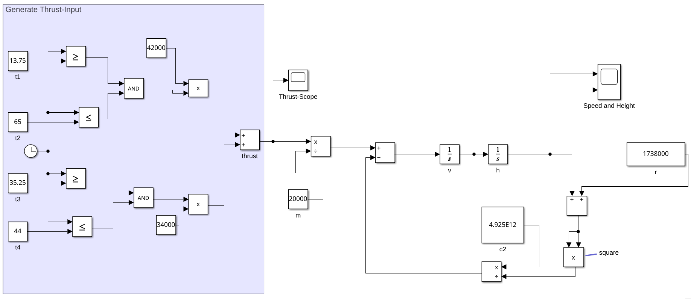
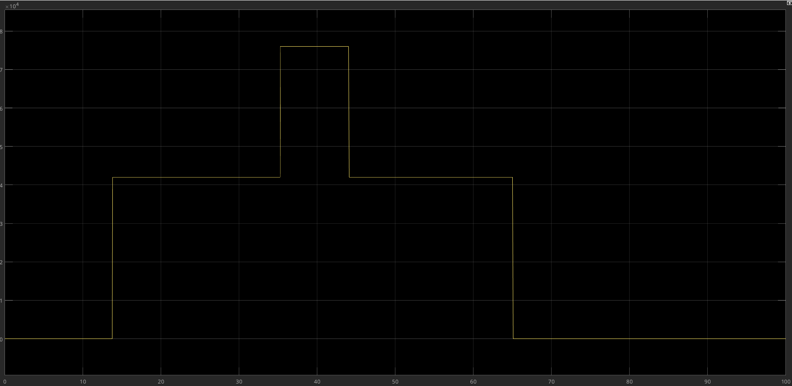
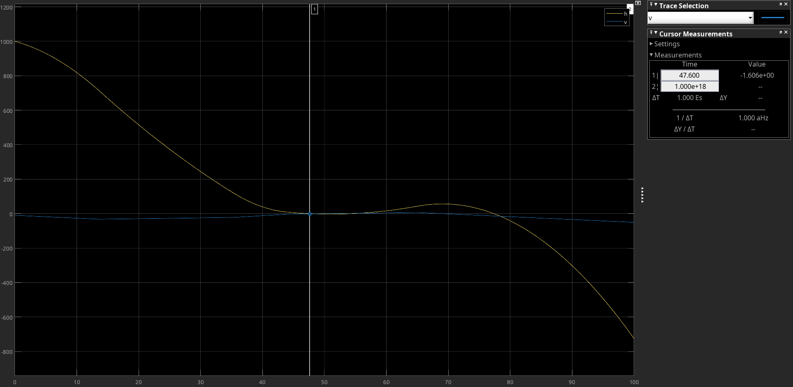
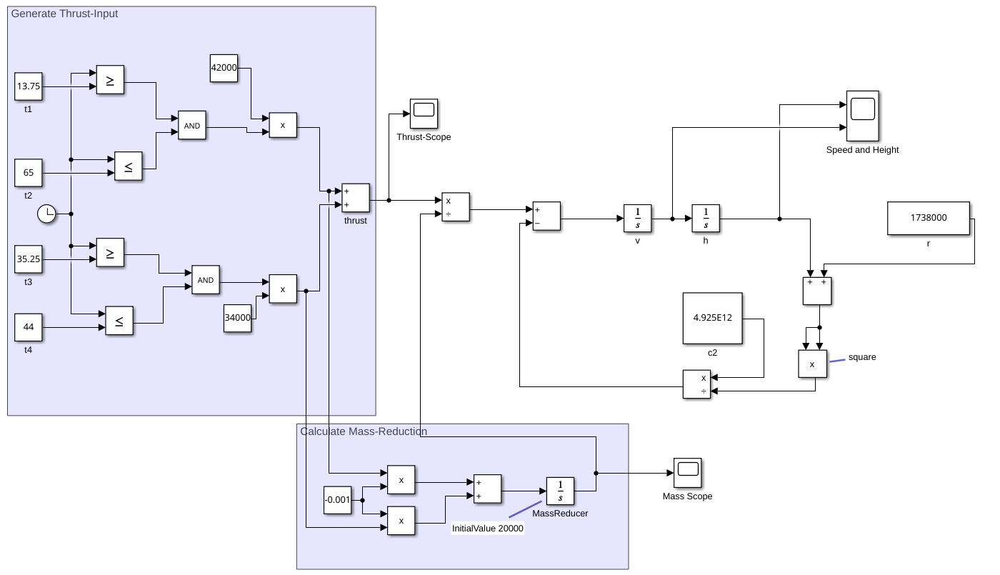
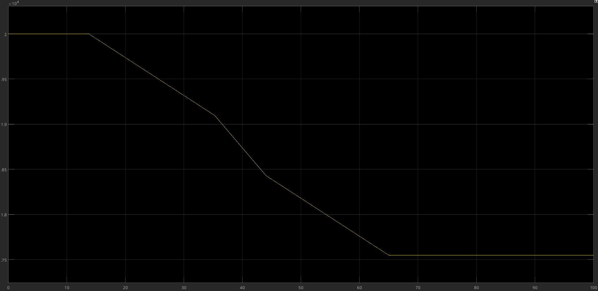
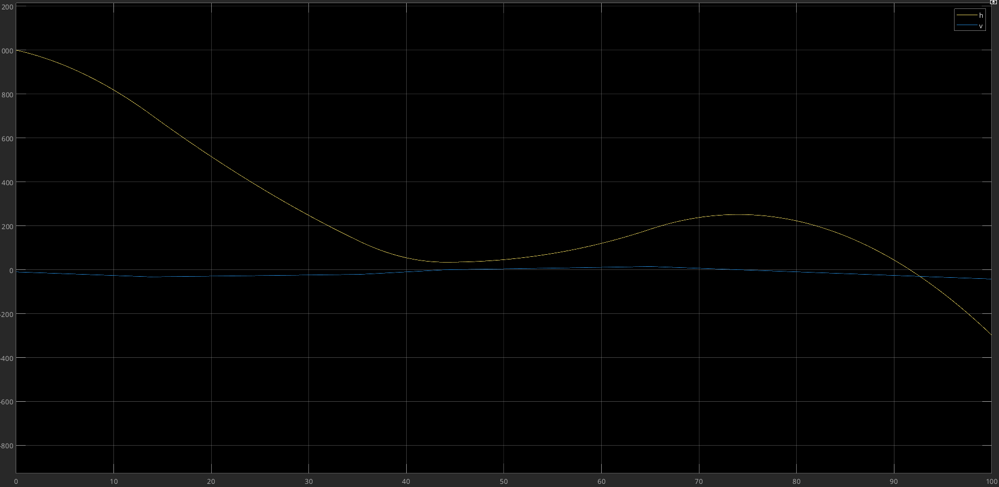
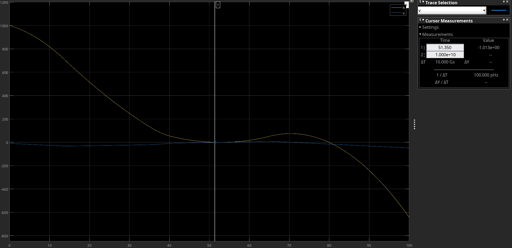
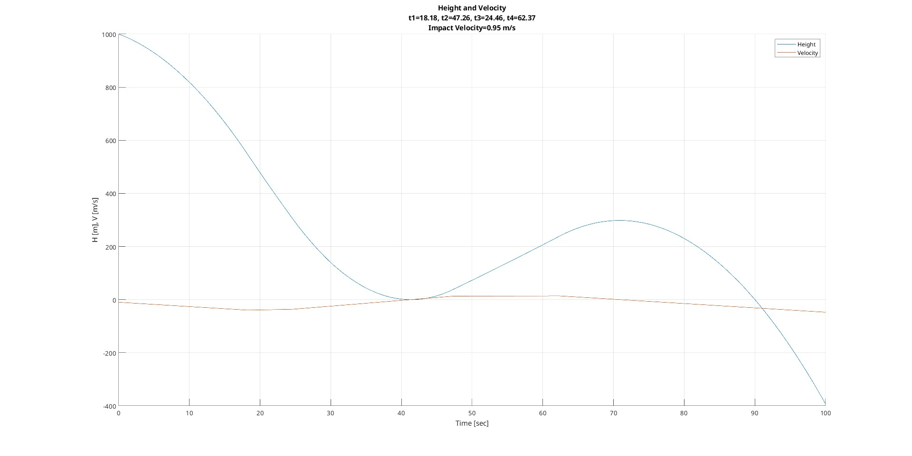
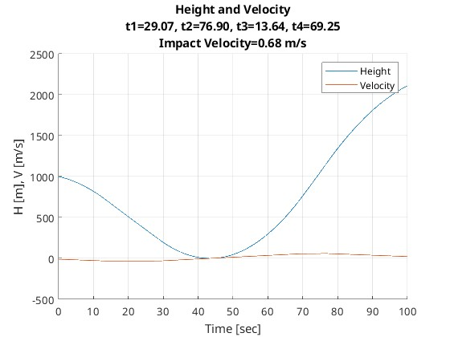

# Task  1
##### a) Use SIMULINK to model the landing of a moon landing unit, as formulated in the lecture notes(idealized and simplified). Assume an initial descent rate of 10 m/s and an initial altitude of 1000 m; the braking force of the two available braking stages are 42,000 N and 34,000 N, respectively, and the mass of the lander is 20,000 kg. Determine optimal start and end times for the braking phases by means of simulation-controlled optimization; document your optimal results in terms of landing time and speed at touchdown.



Mit:
- $t_1=13.75$
- $t_2=65$
- $t_3=35.25$
- $t_4=44$

kann eine Landung nach $47.6s$ mit $-1.6\ m/s$ erreicht werden.
Verwendete Simulationsparameter:
- Solver: *ode4 (Runge-Kutta)*
- Fixe Schrittweite: *0.01*
- Startzeit: *0.0*
- Stopzeit: *100.0*

Erzeugte Kraft der Thruster:


Geschwindigkeit und Höhe



##### b) Do changes of the solver (settings) significantly change the simulation result? Document changes by using other integration methods and changing step size settings. Discuss your results.

Ja, die Änderungen haben tatsächlich signifkante Auswirkungen.

###### Landung nach $n$ Sekunden

|Solver/ Schrittweite $[s]$| Euler  | Heun   | Bogacki-Shampine | Runge-Kutta | 
|---|---|---|---|--- |
|_0.001_|  47.600 | 47.900  | 47.600  | 47.604 |
|_0.01_| 47.608  | 47.921  | 47.604  |47.700 |
|_0.1_| 45.534  | 47.800  | kein Touchdown (minimale Höhe 0.4m nach 50.723s)   | kein Touchdown (minimale Höhe 0.9m nach 50.698s) |

Mit variabler Schrittweite und automatischer Solver-Auswahl in Matlab konnte die Landung nach 47.676s erzielt werden.

###### Geschwindigkeit bei der Landung in $m/s$

|Solver/ Schrittweite $[s]$| Euler  | Heun   | Bogacki-Shampine | Runge-Kutta | 
|---|---|---|---|--- |
|_0.001_|  -1.593  | -1.441 | -1.6006  | -1.609  |
|_0.01_| -1.589 | -1.432  | -1.604  | -1.554 |
|_0.1_| -2.600 | -1.431 | kein Touchdown (Geschwindigkeit im Wendepunkt sinngemäß 0) | kein Touchdown (Geschwindigkeit im Wendepunkt sinngemäß 0)  |

Mit variabler Schrittweite und automatischer Solver-Auswahl in Matlab konnte die Landung mit -1.574 m/s erzielt werden.

###### Interpretation

- **Einfluss der Schrittweite:**
    - Bei kleinen Schrittweiten (0.001s und 0.01s) liefern alle Methoden ähnliche Ergebnisse
    - Bei größerer Schrittweite (0.1s) versagen einige Methoden komplett
        - Bogacki-Shampine und Runge-Kutta erreichen gar keine Landung mehr
        - Euler und Heun liefern deutlich abweichende Ergebnisse
- **Vergleich der Methoden:**
    - Euler als einfachste Methode zeigt die größten Abweichungen
    - Heun ist stabiler als Euler, aber weniger genau als Bogacki-Shampine/Runge-Kutta
    - Bogacki-Shampine und Runge-Kutta liefern die konsistentesten Ergebnisse bei kleinen Schrittweiten
- **Genauigkeit vs. Rechenaufwand:**
    - Kleinere Schrittweiten führen zu genaueren Ergebnissen, benötigen aber mehr Rechenzeit
    - Die Wahl von 0.01s erscheint als guter Kompromiss zwischen Genauigkeit und Effizienz
- **Variable Schrittweite:**
    - auch mit variabler Schrittweite wird eine Landung mit plausiblen Werten erreicht
    - Dies zeigt, dass auch adaptive Methoden gute Ergebnisse liefern können

Diese Ergebnisse unterstreichen die Bedeutung der richtigen Wahl von Solver und Schrittweite für die Genauigkeit und Stabilität der Simulation.


##### c) Assume that braking leads to a decrease of the mass of the lander (factor 0.001). Adapt your model accordingly and document changes regarding the landing oft he landing unit. Again, determine optimal braking parameters (start / end times) and document new landing times and velocities.

Für die Abnahme der Masse durch Treibstoff-Verbrauch wird folgende Formel herangezogen.

$c \dots 0.001 $

$\frac{dm}{dt}=-(c \cdot thrust_1 + c \cdot thrust_2)$ 

###### Neues Blockschaltbild

###### Masse-Abnahme durch Betätigung der Thruster

###### Lande-Versuch mit unkorrigierten Parametern aus 1a)


Aufgrund der unangepassten Parametern und der nun verringerten Masse wird vorerst keine Landung erreicht.
Danach prallt der LunarLander mit ca 28.5m/s auf die Oberfläche. RIP Astronauten, ihr starbt für die Wissenschaft.

Mit einer Senkung der Thrustdauer des 34kN-Thrusters -> eine Reduktion von $t4$ auf auf 40.86s kann auch mit dem neuen Modell der LunarLander sanft gelandet werden. Der Touchdown findet hierbei mit -1.013 m/s nach 51.35s statt.

Mit:
- $t_1=13.75$
- $t_2=65$
- $t_3=35.25$
- $t_4=40.86$

Verwendete Simulationsparameter:
- Solver: *ode4 (Runge-Kutta)*
- Fixe Schrittweite: *0.01*
- Startzeit: *0.0*
- Stopzeit: *100.0*



# Task 2
##### a) Implement an evolutionary optimization algorithm (in MATLAB) based on an ES, which optimizes the lunar landing of Task 1.

Für diesen Task wurde eine μ,λ Evolutions-Strategie implementiert.
Die Implementierung unterliegt folgenden Grundzügen:

###### Problem-Abbildung
- Die vier Parameter (t1, t2, t3, t4) repräsentieren die Start- und Endzeiten der beiden Bremsphasen
- Die Parameter müssen geordnet sein (t1 < t2 und t3 < t4) und im Bereich [0, max_time] liegen
- Die Qualität (Fitness) wird durch die Aufprallgeschwindigkeit v bestimmt

###### Evolutions-Strategie
- μ Eltern erzeugen λ Nachkommen durch Mutation
- Die Strategie kann über den Parameter `selection_type` gewählt werden
- μ+λ: Kombiniert Eltern und Nachkommen, wählt beste μ Individuen
- μ,λ: Wählt nur aus den Nachkommen die besten μ Individuen

###### Mutations-Strategie
- normalverteilte Zufalls-Mutation mit adaptivem λ (Anpassung nach Schwefel)
- Sicherstellung der Parameterordnung durch Vertauschen falls nötig
- Einhaltung der Zeitgrenzen auf [0, max_time]

###### λ-Anpassung
- Implementierung der 1/5-Erfolgsregel zur Anpassung der Mutationsrate
- Auswertung alle n=4 Generationen (entsprechend der Parameterzahl)
- Vergrößerung/Verkleinerung der Schrittweite basierend auf der Erfolgsrate mit dem Faktor 0.82 bzw. 1/0.82 (nach Schwefel)

###### Evaluierung
- Simulation des Landeversuches mit den jeweiligen Zeitparametern
- Qualitätsbewertung basierend auf der Aufprallgeschwindigkeit
- Auch Landeversuche wo kein Tochdown erzielt wird, werden bewertet
(herangezogen wird hierfür die minimale Höhe des Versuches)

##### Implementierung

###### `optimize`-Funktion (Main)
```matlab
function [s] = optimize(model_name, mue, lambda, max_time, delta, n_gens, selection_type)
    % Initialize population
    population = cell(1, mue);
    for i = 1 : mue
        s = init(max_time);
        s = evaluate(model_name, s, max_time);
        population{i} = s;
    end
    
    % Parameters for 1/5 success rule
    n = 4; % Number of parameters (t1-t4)
    success_history = zeros(1, 10*n);
    history_index = 1;
    cd = 0.82;
    ci = 1/0.82;
    current_delta = delta;
    
    current_gen_index = 0;
    while (current_gen_index < n_gens)
        fprintf("Generation: %d\n", current_gen_index);
        offspring = cell(1, lambda);
        successes = 0;
        
        % Create offspring
        for i = 1 : lambda
            index = ceil(rand * mue);
            parent = population{index};
            child = mutate(parent, current_delta, max_time);
            child = evaluate(model_name, child, max_time);
            offspring{i} = child;
            
            if selection_type == "plus"
                % For (μ+λ): smaller values are better
                if child.quality < parent.quality
                    success_history(history_index) = 1;
                    successes = successes + 1;
                else
                    success_history(history_index) = 0;
                end
            else
                % For (μ,λ): larger values are better
                if child.quality > parent.quality
                    success_history(history_index) = 1;
                    successes = successes + 1;
                else
                    success_history(history_index) = 0;
                end
            end
            history_index = mod(history_index, 10*n) + 1;
        end
        
        % Update delta using 1/5 success rule
        if mod(current_gen_index + 1, n) == 0
            success_rate = mean(success_history);
            if success_rate < 0.2
                current_delta = ci * current_delta;
            elseif success_rate > 0.2
                current_delta = cd * current_delta;
            end
            fprintf("Success rate: %.2f, New delta: %.4f\n", success_rate, current_delta);
        end
        
        if selection_type == "plus"
            % (μ+λ) selection: combine parents and offspring
            combined_population = [population, offspring];
            combined_quality = zeros(1, mue + lambda);
            
            % Evaluate combined population
            for i = 1:(mue + lambda)
                combined_quality(i) = combined_population{i}.quality;
            end
            
            % Sort ascending (smaller values are better)
            [~, indices] = sort(combined_quality, 'ascend');
            new_population = cell(1, mue);
            for i = 1:mue
                new_population{i} = combined_population{indices(i)};
            end
        else
            % (μ,λ) selection: select only from offspring
            offspring_quality = zeros(1, lambda);
            for i = 1:lambda
                offspring_quality(i) = offspring{i}.quality;
            end
            [~, indices] = sort(offspring_quality, 'ascend');
            new_population = cell(1, mue);
            for i = 1:mue
                new_population{i} = offspring{indices(i)};
            end
        end
        
        population = new_population;
        current_gen_index = current_gen_index + 1;
        
        if selection_type == "plus"
            fprintf('Best solution in generation %d: %.4f m/s\n', ...
                    current_gen_index, population{1}.quality);
        else
            fprintf('Best solution in generation %d: %.4f\n', ...
                    current_gen_index, population{1}.quality);
        end
    end
    
    % Final results
    figure;
    hold on
    grid on
    best_solution = population{1};
    param_text = sprintf('Height and Velocity\nt1=%.2f, t2=%.2f, t3=%.2f, t4=%.2f\nImpact Velocity=%.2f m/s', ...
        best_solution.t1, best_solution.t2, best_solution.t3, best_solution.t4, best_solution.quality);
    title(param_text);
    
    plot(best_solution.t_prog, best_solution.h_prog);
    plot(best_solution.t_prog, best_solution.v_prog);
    xlabel("Time [sec]");
    ylabel("H [m], V [m/s]");
    legend("Height", "Velocity");
    hold off
    s = best_solution;
end
```

###### `init`-Funktion
```matlab
function [s] = init(max_time)
    s.t1 = rand * max_time;
    s.t2 = rand * max_time;
    s.t3 = rand * max_time;
    s.t4 = rand * max_time;

    % Swap if thrust-times are reversed
    if s.t1 > s.t2
        x = s.t1;
        s.t1 = s.t2;
        s.t2 = x;
    end

    if s.t3 > s.t4
        x = s.t3;
        s.t4 = s.t3;
        s.t3 = x;
    end

    s.quality = [];
    s.h_prog = [];
    s.v_prog = [];
end
```

###### `mutate`-Funktion
```matlab
function [s] = mutate(s, delta, max_time)
    % Mutate timing parameters with Gaussian noise
    s.t1 = s.t1 + randn * delta;
    s.t2 = s.t2 + randn * delta;
    s.t3 = s.t3 + randn * delta;
    s.t4 = s.t4 + randn * delta;
    
    % Ensure all times are non-negative
    s.t1 = max(0, s.t1);
    s.t2 = max(0, s.t2);
    s.t3 = max(0, s.t3);
    s.t4 = max(0, s.t4);
    
    % Ensure all times are less than max_time
    s.t1 = min(max_time, s.t1);
    s.t2 = min(max_time, s.t2);
    s.t3 = min(max_time, s.t3);
    s.t4 = min(max_time, s.t4);
    
    % Ensure correct ordering of thrust times (t1 < t2 and t3 < t4)
    if s.t1 > s.t2
        % Swap t1 and t2
        temp = s.t1;
        s.t1 = s.t2;
        s.t2 = temp;
    end
    
    if s.t3 > s.t4
        % Swap t3 and t4
        temp = s.t3;
        s.t3 = s.t4;
        s.t4 = temp;
    end
    
    % Reset progress tracking variables
    s.quality = [];
    s.h_prog = [];
    s.v_prog = [];
    s.t_prog = [];
end
```

###### `evaluate`-Funktion
```matlab
function [s] = evaluate(model_name, s, maxTime)

    sim_params = simget(model_name);
    params = [0, s.t1, s.t2, s.t3, s.t4];

    [T, ~, Y] = sim(model_name, maxTime, sim_params, params);

    s.h_prog = Y(:, 1);
    s.v_prog = Y(:, 2);
    s.t_prog = T;

    if(min(s.h_prog) < 0)
        % Houston, we have a landing
        index = find(s.h_prog < 0);
        impact = index(1);
        s.quality = -s.v_prog(impact);
    else
        % We did not land, bye major tom
        s.quality = min(s.h_prog) * 10; % A no-touch is not completely bad
    end
end
```


##### b) Which algorithmic parameter sets lead to rather good, which leads to rather bad results? How do you quantify the quality of such an optimization run? Does the adaptation of the mutation width affect the quality of the optimization? How, why? Discuss your results! How does the population size affect the results? How well does the μ+λ ES work here, how good the μ,λ ES? Document your results with different parameter settings, show statistics (graphics, tables) 

###### Erkenntnisse:

- Gute Parameter:
    - μ = 10-20 Elternlösungen
    - λ = 40-80 Nachkommen (Verhältnis λ/μ ≈ 4-5)
    - Ausreichend Diversität bei gleichzeitigem Selektionsdruck
    - δ ≈ 1-5 für dieses Problem (ermöglichte sinnvolle Exploration)

- Schlechte Parameter:
    - μ < 5: Zu wenig Diversität in der Population
    - λ < 20: Unzureichende Erkundung des Lösungsraums
    - λ/μ Verhältnis < 2: Zu geringer Selektionsdruck
    - λ/μ Verhältnis > 10: Rechnerischer Mehraufwand mit minimalem Nutzen
    - δ < 0,1: Zu kleine Schritte, langsame Konvergenz
    - δ > 10: Zu große Schritte, Schwierigkeit gute Lösungen zu finden

- Qualitätsmetriken der Optimierungsqualität:
    - Landegeschwindigkeit (wichtigstes Ziel)
    - Anzahl der Generationen bis zur akzeptablen Lösung

##### Vergleich    ES
###### μ+λ ES
- Vorteile:
    - Verliert nie die besten Lösungen
    - Stabilere Konvergenz
- Nachteile:
    - Kann in lokalen Optima stecken bleiben
    - Weniger anpassungsfähig bei sich ändernden Bedingungen

###### μ,λ ES
- Vorteile:
    - Besser beim Entkommen aus lokalen Optima
    - Besser geeignet für dynamische Probleme
- Nachteile:
    - Kann gute Lösungen verlieren
    - Benötigt größeres λ/μ Verhältnis


###### Plots

Blumenwiese-Fall für
```
optimize('LunarLander_param', 20, 40, 100, 2, 64, 'plus')
```


Blumenwiese-Fall für
```
optimize('LunarLander_param', 20, 40, 100, 1, 64, 'comma')
```



###### Zugrundeliegende Tabellen für die Erkenntnisse

μ,λ
|mue|lambda|delta|n_gens|quality           |
|---|------|-----|------|------------------|
|2  |4     |1    |2             |17.4474964739223  |
|2  |4     |1    |4             |50.7182191078674  |
|2  |4     |1    |16            |44.295040761635   |
|2  |4     |1    |64            |2.71071536428954  |
|2  |4     |1    |128           |7.01414051693806  |
|2  |4     |2    |2             |57.9662734806257  |
|2  |4     |2    |4             |9.44179943599883  |
|2  |4     |2    |16            |19.2791453668547  |
|2  |4     |2    |64            |6.6690759868752   |
|2  |4     |2    |128           |9.59157228049267  |
|2  |4     |3    |2             |57.9662734806257  |
|2  |4     |3    |4             |22.6065660524529  |
|2  |4     |3    |16            |7.61762744429938  |
|2  |4     |3    |64            |6.58229770008145  |
|2  |4     |3    |128           |2.45288297805967  |
|2  |4     |5    |2             |28.2437584738302  |
|2  |4     |5    |4             |13.2394374305167  |
|2  |4     |5    |16            |8.76686780544673  |
|2  |4     |5    |64            |6.30787454966935  |
|2  |4     |5    |128           |1.15478139121814  |
|2  |4     |10   |2             |49.4532745681037  |
|2  |4     |10   |4             |31.1813135149177  |
|2  |4     |10   |16            |15.1810901527039  |
|2  |4     |10   |64            |9.11136622428734  |
|2  |4     |10   |128           |2.09180884780725  |
|4  |8     |1    |2             |25.1137605002469  |
|4  |8     |1    |4             |33.1550637454044  |
|4  |8     |1    |16            |18.6184223020881  |
|4  |8     |1    |64            |7.82508407310554  |
|4  |8     |1    |128           |24.30536409829    |
|4  |8     |2    |2             |17.5417757078063  |
|4  |8     |2    |4             |3.31887995354961  |
|4  |8     |2    |16            |4.79109228711684  |
|4  |8     |2    |64            |0.450517448494022 |
|4  |8     |2    |128           |0.329514660973867 |
|4  |8     |3    |2             |33.0386509853927  |
|4  |8     |3    |4             |18.7551817678232  |
|4  |8     |3    |16            |3.26021159248854  |
|4  |8     |3    |64            |17.2445657235015  |
|4  |8     |3    |128           |1.3098810785002   |
|4  |8     |5    |2             |23.3292446230169  |
|4  |8     |5    |4             |17.5165111196863  |
|4  |8     |5    |16            |12.2637367804662  |
|4  |8     |5    |64            |10.6647093910446  |
|4  |8     |5    |128           |0.733004863804063 |
|4  |8     |10   |2             |28.8008322751274  |
|4  |8     |10   |4             |35.2205949913637  |
|4  |8     |10   |16            |12.1827114973191  |
|4  |8     |10   |64            |6.37589795357318  |
|4  |8     |10   |128           |1.18537591679477  |
|8  |16    |1    |2             |19.3187886785101  |
|8  |16    |1    |4             |28.1990266326384  |
|8  |16    |1    |16           |1.59616541824051  |
|8  |16    |1    |64            |2.14541532464738  |
|8  |16    |1    |128           |0.278029471135961 |
|8  |16    |2    |2             |32.8069485901366  |
|8  |16    |2    |4             |10.456113247766   |
|8  |16    |2    |16            |3.15219938411023  |
|8  |16    |2    |64            |1.77540295341229  |
|8  |16    |2    |128           |0.201825759021883 |
|8  |16    |3    |2             |9.27887763995055  |
|8  |16    |3    |4             |16.6054771837887  |
|8  |16    |3    |16            |10.0018892587626  |
|8  |16    |3    |64            |1.5163569793466   |
|8  |16    |3    |128           |1.11504816286843  |
|8  |16    |5    |2             |11.5644035703139  |
|8  |16    |5    |4            |9.75487151447608  |
|8  |16    |5    |16            |10.2284544948332  |
|8  |16    |5    |64            |0.850202393820301 |
|8  |16    |5    |128           |0.296989073053136 |
|8  |16    |10   |2             |24.9311271030911  |
|8  |16    |10   |4             |19.4154883149703  |
|8  |16    |10   |16            |11.9244806916853  |
|8  |16    |10   |64            |0.998602166010018 |
|8  |16    |10   |128           |0.580653809667364 |
|16 |32    |1    |2             |13.3301269431942  |
|16 |32    |1    |4             |14.778063844969   |
|16 |32    |1    |16            |2.5303345367654   |
|16 |32    |1    |64            |0.515545466807401 |
|16 |32    |1    |128          |0.825817025980736 |
|16 |32    |2    |2             |18.2035411104327  |
|16 |32    |2    |4             |2.38798487861178  |
|16 |32    |2    |16            |3.07951051364081  |
|16 |32    |2    |64            |0.502243352787115 |
|16 |32    |2    |128           |0.108508777053896 |
|16 |32    |3    |2             |11.8440281840175  |
|16 |32    |3    |4             |17.7819170612133  |
|16 |32    |3    |16           |7.15242509785321  |
|16 |32    |3    |64            |1.73812114774409  |
|16 |32    |3    |128           |0.123393766056736 |
|16 |32    |5    |2             |11.0342573943916  |
|16 |32    |5    |4             |27.2316639270427  |
|16 |32    |5    |16           |11.7369615015473  |
|16 |32    |5    |64            |1.28833118438278  |
|16 |32    |5    |128           |0.112370694844151 |
|16 |32    |10   |2             |7.87670317770466  |
|16 |32    |10   |4             |20.7221038454249  |
|16 |32    |10   |16            |21.0520675070931  |
|16 |32    |10   |64            |2.35384458381269  |
|16 |32    |10   |128           |0.107765652052768 |
|32 |64    |1    |2             |9.13822591228842  |
|32 |64    |1    |4             |2.17140893713754  |
|32 |64    |1    |16            |11.5694596014968  |
|32 |64    |1    |64            |0.502243352787115 |
|32 |64    |1    |128          |0.0373160036277008|
|32 |64    |2    |2             |16.9354207684853  |
|32 |64    |2    |4             |12.2865209468733  |
|32 |64    |2    |16            |2.24594975770472  |
|32 |64    |2    |64            |1.4913377787521   |
|32 |64    |2    |128           |0.0620897634691766|
|32 |64    |3    |2             |12.2194708319151  |
|32 |64    |3    |4            |6.84263174135248  |
|32 |64    |3    |16            |1.92243376880176  |
|32 |64    |3    |64            |0.467618432762283 |
|32 |64    |3    |128           |0.055860246019214 |
|32 |64    |5    |2             |9.92462752589043  |
|32 |64    |5    |4             |10.5417656145207  |
|32 |64    |5    |16            |8.1186816040535   |
|32 |64    |5    |64            |0.368111067000221 |
|32 |64    |5    |128          |0.181301734735342 |
|32 |64    |10   |2             |7.65773408730831  |
|32 |64    |10   |4             |21.5101642779824  |
|32 |64    |10   |16            |3.05515024474703  |
|32 |64    |10   |64            |5.27302176930491  |
|32 |64    |10   |128           |2.69988297885249  |


μ+λ
|mue|lambda|delta|n_gens|quality           |
|---|------|-----|------|------------------|
|2  |4     |1    |2             |26.8566422502157  |
|2  |4     |1    |4             |52.105035071818   |
|2  |4     |1    |16            |9.33280107809442  |
|2  |4     |1    |64            |2.47761734154061  |
|2  |4     |1    |128           |1.15905553707055  |
|2  |4     |2    |2             |11.011879879585   |
|2  |4     |2    |4             |23.7399241266226  |
|2  |4     |2    |16            |7.54481348603572  |
|2  |4     |2    |64            |6.57743355173415  |
|2  |4     |2    |128           |2.31784074653828  |
|2  |4     |3    |2             |7.34323945586846  |
|2  |4     |3    |4             |25.7636316628789  |
|2  |4     |3    |16            |34.9797690398827  |
|2  |4     |3    |64            |8.84666450019503  |
|2  |4     |3    |128           |2.6861954351033   |
|2  |4     |5    |2             |43.6544094896015  |
|2  |4     |5    |4             |14.61547168473    |
|2  |4     |5    |16            |4.33258485215313  |
|2  |4     |5    |64            |5.9295359132154   |
|2  |4     |5    |128           |0.502243352787115 |
|2  |4     |10   |2             |14.3542537320007  |
|2  |4     |10   |4             |13.6712866857576  |
|2  |4     |10   |16            |7.57924529764901  |
|2  |4     |10   |64            |4.33258485215313  |
|2  |4     |10   |128           |10.908447862202   |
|4  |8     |1    |2             |13.450754066378   |
|4  |8     |1    |4             |39.9335137833483  |
|4  |8     |1    |16            |1.06800281175322  |
|4  |8     |1    |64            |1.41908793526527  |
|4  |8     |1    |128           |3.09847407186937  |
|4  |8     |2    |2             |20.6934038053896  |
|4  |8     |2    |4             |9.97944574355356  |
|4  |8     |2    |16            |10.6360383600728  |
|4  |8     |2    |64            |1.94214148274036  |
|4  |8     |2    |128           |1.60942067929293  |
|4  |8     |3    |2             |30.2933668111932  |
|4  |8     |3    |4             |8.39970625959421  |
|4  |8     |3    |16            |2.88472209468183  |
|4  |8     |3    |64            |5.62058784438869  |
|4  |8     |3    |128           |1.58811518294145  |
|4  |8     |5    |2             |11.0696051480341  |
|4  |8     |5    |4             |12.9419657341538  |
|4  |8     |5    |16            |13.2121611718576  |
|4  |8     |5    |64            |2.95278201043102  |
|4  |8     |5    |128           |0.292563334810638 |
|4  |8     |10   |2             |7.74494084070036  |
|4  |8     |10   |4             |1.91358741806152  |
|4  |8     |10   |16            |3.46023845052069  |
|4  |8     |10   |64            |9.08430207891483  |
|4  |8     |10   |128           |0.0215701142315155|
|8  |16    |1    |2             |8.67256699761417  |
|8  |16    |1    |4             |5.07398287154979  |
|8  |16    |1    |16            |10.1107648048886  |
|8  |16    |1    |64            |2.16903601767351  |
|8  |16    |1    |128           |0.502243352787115 |
|8  |16    |2    |2             |38.4726763683584  |
|8  |16    |2    |4             |5.16078480124402  |
|8  |16    |2    |16            |2.21240444786903  |
|8  |16    |2    |64            |0.504121665403451 |
|8  |16    |2    |128           |2.73895309276319  |
|8  |16    |3    |2             |6.09677054346687  |
|8  |16    |3    |4             |18.9177963432919  |
|8  |16    |3    |16            |2.8415198172889   |
|8  |16    |3    |64            |3.72250434805619  |
|8  |16    |3    |128           |1.36755676923382  |
|8  |16    |5    |2             |14.7593298332551  |
|8  |16    |5    |4             |17.6227453357386  |
|8  |16    |5    |16            |5.47135926662169  |
|8  |16    |5    |64            |3.54342891636101  |
|8  |16    |5    |128           |0.894564977526695 |
|8  |16    |10   |2             |24.6007678861455  |
|8  |16    |10   |4             |4.16129693869814  |
|8  |16    |10   |16            |3.25478988231297  |
|8  |16    |10   |64            |1.98353826831248  |
|8  |16    |10   |128           |1.44121822568378  |
|16 |32    |1    |2             |2.31941966491519  |
|16 |32    |1    |4             |10.5053162202772  |
|16 |32    |1    |16            |1.05978973988932  |
|16 |32    |1    |64            |0.0215701142315155|
|16 |32    |1    |128           |1.18537591679477  |
|16 |32    |2    |2             |8.77014791259228  |
|16 |32    |2    |4             |4.35290411956827  |
|16 |32    |2    |16            |0.856114473616631 |
|16 |32    |2    |64            |2.20174551953915  |
|16 |32    |2    |128          |0.499947222002205 |
|16 |32    |3    |2             |8.58950692459868  |
|16 |32    |3    |4             |4.46163043647497  |
|16 |32    |3    |16            |0.846371508009078 |
|16 |32    |3    |64            |0.992251463732104 |
|16 |32    |3    |128           |2.34312688834216  |
|16 |32    |5    |2             |11.9225620094402  |
|16 |32    |5    |4             |6.58483795807574  |
|16 |32    |5    |16            |2.3088308600618   |
|16 |32    |5    |64            |1.04231840882847  |
|16 |32    |5    |128           |1.5920689201768   |
|16 |32    |10   |2             |18.9575725729873  |
|16 |32    |10   |4             |5.64430302029977  |
|16 |32    |10   |16            |4.19414771670561  |
|16 |32    |10   |64            |3.98653671515338  |
|16 |32    |10   |128           |1.12573094564085  |
|32 |64    |1    |2             |2.82898377064912  |
|32 |64    |1    |4             |4.07092741126209  |
|32 |64    |1    |16            |0.0215701142315155|
|32 |64    |1    |64            |0.469901630028643 |
|32 |64    |1    |128          |0.546380586394623 |
|32 |64    |2    |2             |6.61278900527827  |
|32 |64    |2    |4             |0.814068890326561 |
|32 |64    |2    |16            |0.502243352787115 |
|32 |64    |2    |64            |0.444359583323041 |
|32 |64    |2    |128           |0.143763679639798 |
|32 |64    |3    |2             |0.981314598663489 |
|32 |64    |3    |4             |2.28858847802462  |
|32 |64    |3    |16            |0.795691980971611 |
|32 |64    |3    |64            |0.502243352787115 |
|32 |64    |3    |128           |0.502243352787115 |
|32 |64    |5    |2             |9.41015901760692  |
|32 |64    |5    |4             |2.10022378209056  |
|32 |64    |5    |16            |0.686081805115739 |
|32 |64    |5    |64            |1.19920303392813  |
|32 |64    |5    |128           |0.712028862344285 |
|32 |64    |10   |2             |11.5218787899959  |
|32 |64    |10   |4             |3.75201692485414  |
|32 |64    |10   |16            |2.63883757161066  |
|32 |64    |10   |64            |4.23872831052704  |
|32 |64    |10   |128           |1.39211075003698  |
