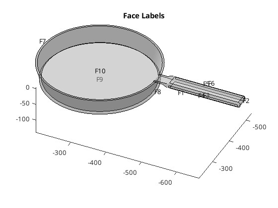
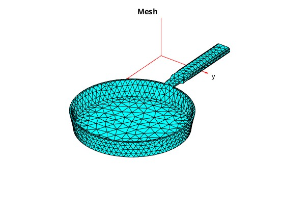
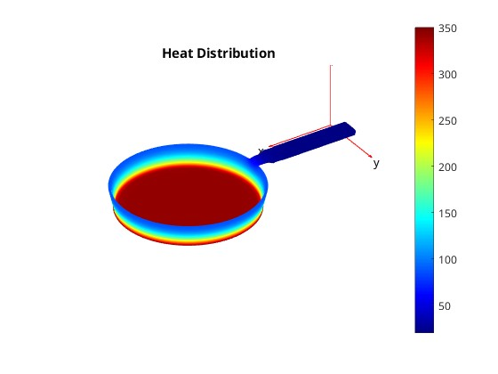

# Übung 08 Maximilian Burger

## Beispiel 1

Als Beispiel-Geometrie wurde ein Winkel-Bauteil gewählt, eine Standardkomponente aus dem Industrieanlagen-Bau.


Als feste Fläche wird `F4` gewählt, gegen `F13` wird mit $300 N$ gedrückt.

## Lösungsidee
Die Lösungsidee ist kein eigens implementierter Algorithmus, sondern eine Abfolge von Matlab-Library-Calls.

1. Modellerstellung und Geometrieimport
    - Erstellen eines PDE-Modells
    - Import des STL-Files
    - Definition der Materialeigenschaften (Stahl)
    - Festlegung der Randbedingungen (fixierte Fläche und Oberflächenlast)


2. Vernetzung
    - Generierung des Finite-Elemente-Netzes
    - Visualisierung des Netzes als 3D-Plot zur Validierung

3. Berechnung und Lösung
    - Lösen des FEM-Gleichungssystems
    - Berechnung der Von-Mises-Spannungen
    - Ermittlung der Verformungen in allen Raumrichtungen

4. Ergebnisdarstellung
    - Visualisierung der Verformungen in X-Richtung
    - Darstellung der Von-Mises-Spannungsverteilung

## Implementierung

```matlab
model = createpde("structural", "static-solid");
importGeometry(model, "50x50x25.stl");

figure
pdegplot(model, "FaceLabels", "on", "FaceAlpha", 0.8)
view(30,30)
title("Stahlwinkel")

% Material Parameters und Boundary Conditions
structuralProperties(model, "YoungsModulus", 210e3, "PoissonsRatio", 0.29)
structuralBC(model, "Face", 4, "Constraint", "fixed")
structuralBoundaryLoad(model, "Face", 13, "SurfaceTraction", [-300; 0; 0])

% Meshing
figure
mesh = generateMesh(model);
pdeplot3D(model)
title("Mesh")

% Solve
result = solve(model);

% Postprocessing
fig = figure;
pdeplot3D(model, "ColorMapData", result.Displacement.x)
title("Displacement in X")
colormap("jet")


figure
pdeplot3D(model, "ColorMapData", result.VonMisesStress)
title("Von Mises Stress")
colormap("jet")

maxStress = max(result.VonMisesStress);
maxDisp = max(sqrt(result.Displacement.x.^2 + ...
                  result.Displacement.y.^2 + ...
                  result.Displacement.z.^2));
fprintf('Maximum von Mises stress: %.2f Pa\n', maxStress)
fprintf('Maximum displacement: %.2f mm\n', maxDisp)
```

## Ergebnis


### Ausgabe
```
Maximum von Mises stress: 10040.18 Pa
Maximum displacement: 4.64 mm
```

Quelle 3D-Modell: https://www.thingiverse.com/thing:4866024

Die Werte und die Verformung wirken plausibel, für eine genaue Beurteilung fehlt es mir an mechanischen Hintergrundwissen. :(

## Beispiel 2

Als zweites Beispiel wurde eine Wärme-Transfer-Simulation gewählt. Untersucht wird, ob der Griff einer Pfanne auch bei einer Erwärmung des Pfannenbodens berührbar bleibt, in aller Bescheidenheit wird als Pfannenwerkstoff Silber (guter Wärmeleiter) gewählt.



Der Pfannenboden (`F9`) wird mit $350 K$ beheizt.


## Lösungsidee

Die Lösungsidee ist kein eigens implementierter Algorithmus, sondern eine Abfolge von Matlab-Library-Calls.

1. Modellerstellung und Geometrieimport
    - Erstellen eines thermischen PDE-Modells für stationäre Analyse (System im ausgeglichenen Zustand)
    - Import des STL-Files 


2. Materialeigenschaften und Randbedingungen
    - Definition der thermischen Materialeigenschaften für Silber:
        - Dichte: 10490 kg/m³
        - Spezifische Wärmekapazität: 235 J/(kg·K)
        - Wärmeleitfähigkeit: 429 W/(m·K)


    - Festlegung der Initialtemperatur (20°K)   
    - Heizfläche (Fläche 9) mit 350°K
    - Konvektion an allen anderen Flächen mit h = 2 W/(m²·K)
    (gängiger Konvektions-Wert an der freien Luft)

3. Vernetzung
    - Generierung des Meshes
    - Visualisierung des Netzes als 3D-Plot für die Validierung


4. Berechnung und Ergebnisdarstellung
    - Lösen des stationären Wärmeleitungsproblems (Endzustand)
    - Visualisierung der Temperaturverteilung als farbcodierte 3D-Heatmapt
    - Darstellung mit Farbskala 

## Implementierung

```matlab
model = createpde('thermal', 'steadystate');

importGeometry(model, "PanV2.stl");

% plot faces
figure
pdegplot(model, "FaceLabels", "on", "FaceAlpha", 0.3);
title("Face Labels")

% PVC - bad heat conductor
%thermalProperties(model, "MassDensity", 1380, ... % kg/m³
%    "SpecificHeat", 900, ... % J/(kg·K)
%    "ThermalConductivity", 0.19); % W/(m·K)


% silver - good conductor
thermalProperties(model, "MassDensity", 10490, ... % kg/m³
    "SpecificHeat", 235, ... % J/(kg·K)
    "ThermalConductivity", 429); % W/(m·K)

% init temperature
T_ext = 20; 
thermalIC(model, T_ext); 

% heat face
thermalBC(model, 'Face', 9, 'Temperature', 350);
h = 2; 

% convection cool all other faces
allFaces = 1:model.Geometry.NumFaces;
thermalBC(model, 'Face', [1:8, 10:max(allFaces)], 'ConvectionCoefficient', h, 'AmbientTemperature', T_ext);

mesh = generateMesh(model);
figure
pdeplot3D(model)
title("Mesh")


result = solve(model);

% plot
figure
pdeplot3D(model, 'ColorMapData', result.Temperature)
title("Heat Distribution")
colormap('jet')
colorbar
view(30,30)
drawnow
```

## Ergebnisse





Anhand der Farbskala ist zu entnehmen, dass obwohl die Pfannen-Innenseite gut durchgeheizt ist, der Griff berührbar bleit.

>$300K$ Pfannenboden-Temperatur und $20K$ sind absolut gesehen sehr niedrige Temperaturen, jedoch spielt nur der relative Unterschied zwischen Pfanne und Umgebungs-Temperatur für die Simulation eine Rolle.

Das verwendete 3D-Modell wurde selbst erstellt.
