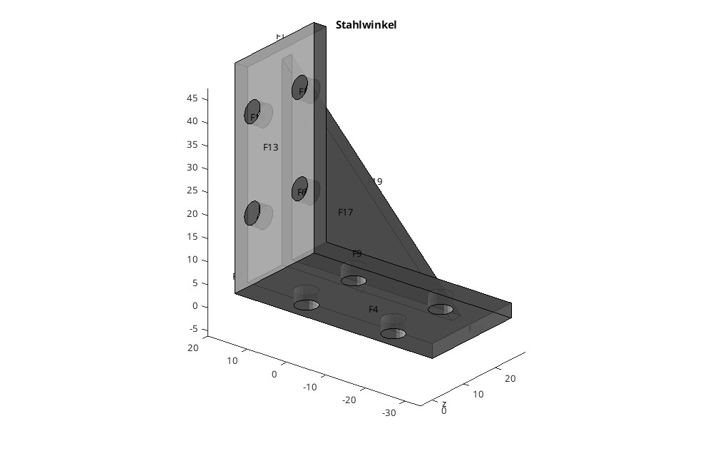
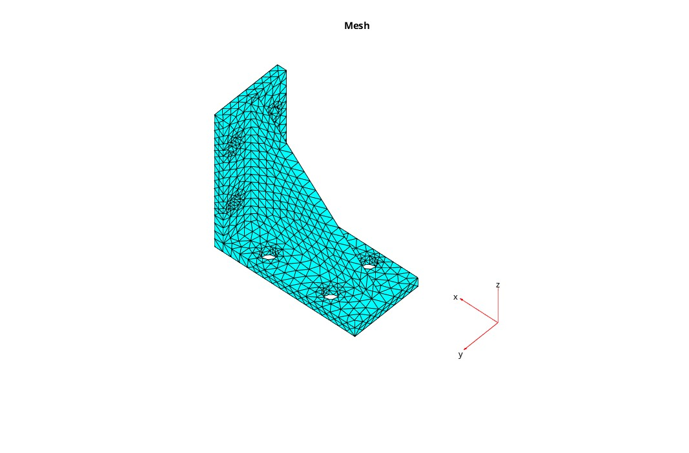
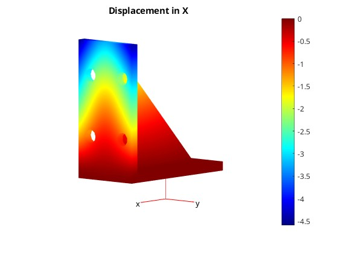
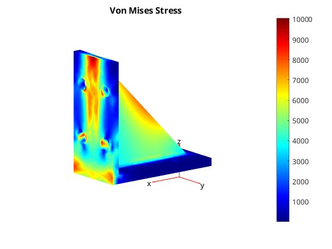

# Übung 08 Maximilian Burger

## Beispiel 1

Als Beispiel-Geometrie wurde ein Winkel-Bauteil gewählt, eine Standardkomponente aus dem Industrieanlagen-Bau.



Als feste Fläche wird `F4` gewählt, gegen `F13` wird mit $300 N$ gedrückt.

## Lösungsidee
Die Lösungsidee ist kein eigens implementierter Algorithmus, sondern eine Abfolge von Matlab-Library-Calls.

1. Modellerstellung und Geometrieimport
    - Erstellen eines PDE-Modells
    - Import des STL-Files
    - Definition der Materialeigenschaften (Stahl)
    - Festlegung der Randbedingungen (fixierte Fläche und Oberflächenlast)


2. Vernetzung
    - Generierung des Finite-Elemente-Netzes
    - Visualisierung des Netzes als 3D-Plot zur Validierung

3. Berechnung und Lösung
    - Lösen des FEM-Gleichungssystems
    - Berechnung der Von-Mises-Spannungen
    - Ermittlung der Verformungen in allen Raumrichtungen

4. Ergebnisdarstellung
    - Visualisierung der Verformungen in X-Richtung
    - Darstellung der Von-Mises-Spannungsverteilung

```matlab
model = createpde("structural", "static-solid");
importGeometry(model, "50x50x25.stl");

figure
pdegplot(model, "FaceLabels", "on", "FaceAlpha", 0.8)
view(30,30)
title("Stahlwinkel")

% Material Parameters und Boundary Conditions
structuralProperties(model, "YoungsModulus", 210e3, "PoissonsRatio", 0.29)
structuralBC(model, "Face", 4, "Constraint", "fixed")
structuralBoundaryLoad(model, "Face", 13, "SurfaceTraction", [-300; 0; 0])

% Meshing
figure
mesh = generateMesh(model);
pdeplot3D(model)
title("Mesh")

% Solve
result = solve(model);

% Postprocessing
fig = figure;
pdeplot3D(model, "ColorMapData", result.Displacement.x)
title("Displacement in X")
colormap("jet")


figure
pdeplot3D(model, "ColorMapData", result.VonMisesStress)
title("Von Mises Stress")
colormap("jet")

maxStress = max(result.VonMisesStress);
maxDisp = max(sqrt(result.Displacement.x.^2 + ...
                  result.Displacement.y.^2 + ...
                  result.Displacement.z.^2));
fprintf('Maximum von Mises stress: %.2f Pa\n', maxStress)
fprintf('Maximum displacement: %.2f mm\n', maxDisp)
```

## Ergebnis







### Ausgabe
```
Maximum von Mises stress: 10040.18 Pa
Maximum displacement: 4.64 mm
```

Die Werte und die Verformung wirken plausibel, für eine genaue Beurteilung fehlt es mir an mechanischen Hintergrundwissen. :(