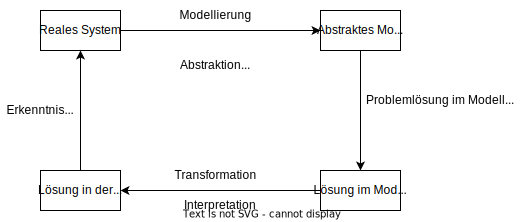
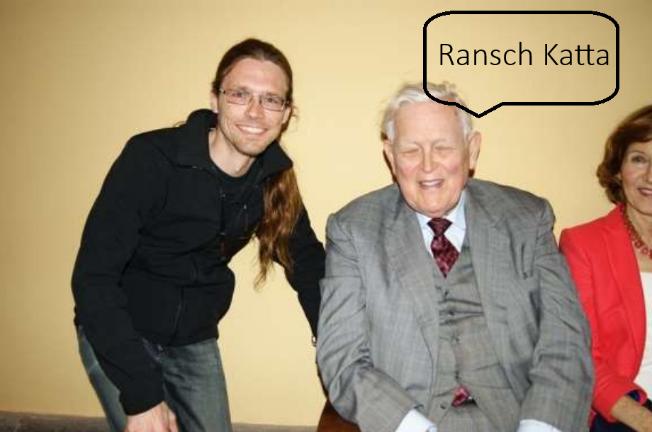

# Einleitung

## Modellbasiertes Problemlösen

- **Modellierung**: Die Modellierung ist der Prozess der Überführung eines realen Systems in ein abstraktes Abbild. Dabei werden die wesentlichen Eigenschaften und Verhaltensweisen des Systems in eine formale Darstellung übertragen. (*Bsp.: Differentialgleichung, Blockschaltbild*)
- **Abstraktion**: Bei der Abstraktion werden unwichtige Details weggelassen, um sich auf das Wesentliche zu konzentrieren. Es ist der Prozess der Verallgemeinerung, bei dem man von spezifischen Eigenschaften absieht und nur die für das Problem relevanten Aspekte betrachtet und somit zwei spezifisch unterschiedliche Dinge auf abstrakter Ebene als "gleich" betrachten kann. (*Bsp.: egal ob T-Rex oder Feuersalamander, im Modell sind beide Predator*)
- **Idealisierung**: Die Idealisierung vereinfacht komplexe Sachverhalte durch Annahme von perfekten oder idealen Bedingungen. Dabei werden beispielsweise Störfaktoren oder Ungenauigkeiten bewusst vernachlässigt, um ein klareres Modell zu erhalten. (*Bsp.: Messungenauigkeiten für eine Regelung werden vernachlässigt*)
- **Vereinfachung**: Bei der Vereinfachung werden komplexe Zusammenhänge auf ihre grundlegenden Beziehungen reduziert. Ziel ist es, das System handhabbarer zu machen, ohne die wichtigen Eigenschaften zu verlieren. (*Bsp.: Reibungsverluste werden vernachlässigt*)
- **Aggregation**: Die Aggregation fasst mehrere Einzelteile oder Details zu größeren Einheiten zusammen. Statt viele Einzelelemente zu betrachten, werden diese zu übergeordneten Gruppen oder Kategorien zusammengefasst, um die Komplexität zu reduzieren. (*Bsp.: Monatsumsatz statt Einzelverkäufe wird betrachtet*)

## Simulation
Computersimulation ist die Nachbildung realer Systeme mit Computern. Der Fokus dieser LVA liegt auf dynamischen Systemen, also solchen, die sich über die Zeit und/oder im Raum verändern können.

### Warum überhaupt Simulation?

#### Problem nicht analytisch lösbar
- Fragen können zwar formuliert werden, aber
- keine effektiven/effizienten Antworten/Lösungen können entwickelt werden
(*Effektiv* bedeutet, dass überhaupt eine funktionierende Lösung gefunden werden kann, die zum gewünschten Ziel führt - also die Wirksamkeit einer Lösung. (Eine ineffektive Lösung würde das Problem gar nicht lösen))
(*Effizient* bezieht sich darauf, wie gut die Ressourcen (Zeit, Rechenleistung, Kosten etc.) bei der Lösungsfindung genutzt werden - also die Wirtschaftlichkeit einer Lösung.)

#### Reales Experiment (d.h. am echten System) nicht möglich
- zu kostspielig
- benötigt zu viel Zeit
- zu schwierig (z.B. zu beobachten)
- zu riskant
- Experiment nicht rückgängig zu machen/irreversibel

>Simulation wenn:
>- ... ein Problem zu komplex ist, um es mit analytischen Methoden zu lösen
>- ... echte Experimente aus praktischen, zeitlichen, finanziellen, sicherheitstechnischen oder anderwertigen Gründen nicht durchführbar sind.

### Fragestellungen welche mit Simulation bearbeitet werden

1. Überprüfung von Hypothesen:
Testen und Validieren von Annahmen und Theorien durch Simulation
2. Vorhersage
Prognose zukünftiger Systemzustände und Entwicklungen
3. Verbesserung
Optimierung und Weiterentwicklung bestehender Systeme und Prozesse
4. Design/Gestaltung
Entwicklung und Planung neuer Systeme oder Komponenten
5. Lehre
Einsatz von Simulationen zu Ausbildungs- und Schulungszwecken
6. Unterhaltung
Verwendung von Simulationen für Spiele und Entertainment-Anwendungen (*GTA als Real Life Simulator* :D )

### Probleme der Modellierung und Simulation
- **Toy Duck Approach** bei der Modellierung
*"Wind it up and let it run"* Ein zu vereinfachter, oberflächlicher Ansatz ohne tieferes Verständnis des Systems wird gewählt.
-  **Modellgültigkeit**
Inwieweit sind die abgeleiteten Annahmen auf die reale Welt übertragbar? Frage nach der Validität und Übertragbarkeit der Simulationsergebnisse
- Es können **keine allgemeingültigen Aussagen** abgeleitet werden
Stattdessen nur eine Sammlung von Experimenten, die für einen spezifischen Kontext gültig sind. Die Ergebnisse sind kontextabhängig und nicht universell anwendbar.
- **Optimale Problemlösung** kann **nicht** garantiert werden
Es gibt keine Garantie, dass die durch Simulation gefundene Lösung tatsächlich optimal ist

### Anforderungen an die Durchführung einer Simulation
Korrekte, d.h. angemessene Realisierung/Implementierung in Bezug auf:
- Dynamisches Verhalten
- Keine Kausalitätsfehler
- Strategien zur Konfliktlösung (Zeitliche/Ressourcen Konflikte in der Implementierung oder im Modell)
- Angemessene numerische Methoden und Wahl der Schrittweite, z.B. zur Vermeidung von numerischen Ungenauigkeiten oder Instabilitäten
Die Simulation soll effizient durchgeführt werden können:
- Parallele, verteilte Ansätze

> In einer Simulation ist es wichtig, dass die modellierten Beziehungen zwischen Variablen oder Ereignissen auf echten Kausalzusammenhängen basieren und nicht nur auf beobachteten Korrelationen. **Korrelation**: Zwei Ereignisse treten gemeinsam auf oder zwei Variablen bewegen sich ähnlich. (*Wenn mehr Störche in einer Region sind, werden dort mehr Babys geboren*) **Kausalität**: Ein Ereignis ist tatsächlich die direkte Ursache für ein anderes. (*Wenn man Wasser erhitzt, steigt die Wassertemperatur*)

### Die zwei Hauptbereiche der Modellierung und Simulation

#### Kontinuierliche Modellierung und Simulation
- Gleichungsmodelle mit unendlich vielen Änderungen in jedem Zeitintervall
- Explizite Beziehungen zwischen Zuständen und Zeit (und daraus resultierende Unstetigkeiten) werden nicht berücksichtigt

#### Diskrete Modellierung und Simulation
- In jedem Zeitintervall gibt es nur endlich viele relevante/interessante Änderungen
- Zustandsübergänge erfolgen zu präzisen Zeitpunkten

#### Anwendungsbereiche

| Kontinuierliche Simulation  | Diskrete Simulation   |
|---|---|
| Elektronik  | Produktions-Systeme  |
| Mechatronik  | Transport-Systeme  |
| Regelungstechnik  | Geschäftsprozesse  |
| Wetter-Berechnungen  | LAN-Simulation  |
| Wirtschafts-Modelle  | Logistik  |
| ...  | ...  |

## Modellierung
Man betreibt Abstraktion auf die wesentlichen Teile von Systemen, angetrieben durch die Definition der Modellierungs-/Simulations-Ziele:
- Auswahl von Elementen
- Abstraktion/Aggregation von Komponenten
- Abstraktion/Aggregation von Zuständen
- Abstraktion von Verhalten

### Deduktive Modellierung
Modellierung basierend auf Wissen und Einsicht in den Prozess:
- Regeln, Gleichungen, Gesetze, Prinzipien
- Grundlegendes Wissen, Lehrsätze
- Strukturelles Wissen

Der deduktive Ansatz geht von bekanntem Wissen und Theorien aus und leitet daraus das Modell ab.

### Induktive Modellierung
Modellierung basierend auf gemessenen Daten zur Identifizierung und Verifizierung von Modellen:
- Beobachtungen, Messungen, Annahmen
- Statistische Ansätze, Data Mining, Künstliche Intelligenz

Der induktive Ansatz beginnt bei konkreten Beobachtungen und Daten und versucht daraus allgemeinere Modelle abzuleiten.

## System-Theorie - Die Basics

Im allgemeinen Fall werden die Inputs nicht von den Interaktionen der Komponenten beeinflusst.

Mathematisch wird ein allgemeines dynamisches System als 6-Tupel formuliert:
$S=(T, A, B, Q, \delta, \lambda)$ (System, Automat)
- $T$ Zeitdomäne (Zeitbereich)
- $A$ Eingangsdomäne (Eingangsbereich)
- $B$ Ausgangsdomäne (Ausgangsbereich)
- $Q$ Zustands-Menge
- $\delta : Q \times A \rightarrow Q$ globale Zustandsübergangsfunktion
- $\lambda : Q \times B \rightarrow Q$ Ausgabefunktion

Die Zustandsübergangsfunktion $\delta$ definiert, wie sich der Systemzustand basierend auf dem aktuellen Zustand und Eingang ändert. Die Ausgabefunktion $\lambda$ bestimmt, welche Ausgabe das System bei gegebenem Zustand und Eingang erzeugt.

## Der Modellbasierte Lösungs-Prozess

## Realtime vs. Simulationszeit

- Während eines Simulationsschritts wird Realtime (Laufzeit) verbraucht, aber keine Simulationszeit
- Während der Aktualisierung der Simulationszeit wird Simulationszeit verbraucht, aber keine Realtime

D.h. die Modell-/Simulationszeit ist unabhängig von der tatsächlichen Ausführungszeit (Realtime/Laufzeit) der Berechnungen. Das bedeutet:

- Die Simulation kann schneller als Realtime laufen
- Sie kann auch langsamer als Realtime laufen (wenn komplexe Berechnungen nötig sind/ der Prozess in echt sehr schnell ist)
- Die Ergebnisse der Simulation bleiben gleich, unabhängig davon, wie lange die Berechnung tatsächlich dauert.

## Kontinuierliche Simulation

- Modell-Formalismus: Differentialgleichungssysteme
- Simulationsmethode: Numerische Integration
    - Kontinuierliches Verhalten muss angemessen diskretisiert werden
    - Berechnung von Zeitschritt zu Zeitschritt

Obwohl das reale System kontinuierlich ist, muss es für die computergestützte Simulation in diskrete Zeitschritte zerlegt werden. Die Genauigkeit der Simulation hängt dabei von der Wahl der Zeitschrittweite ab. Als **Simulations-Fehler** bezeichnet man die Abweichung zum echten Werte-Verlauf.

## Diskrete Schrittweise Simulation

- Modell-Formalismus: Differenzensystemen und endlichen Zustandsautomaten
- Simulationsmethode: Zeitgetaktete Simulation
    - Taktgeber wird benötigt
    - Die Bestimmung von Zustand/Zuständen im nächsten Zeitschritt durch definierte Zustandsübergänge

Bei der diskreten schrittweisen Simulation werden Systeme betrachtet, die sich in definierten Zeitschritten von einem Zustand in den nächsten bewegen. Ein vorgegebener Takt (Clock) bestimmt dabei die Intervalle, in denen Zustandsänderungen möglich sind. Die Zustandsübergänge werden durch vorab definierte Regeln festgelegt, die beschreiben, wie sich das System von einem Zeitpunkt zum nächsten entwickeln kann.´

## Ereignisorientierte Diskrete Simulation

- Modell-Formalismus: Diskrete Ereignissysteme (DEVS)
    - Ereignisse können zu jeder Zeit auftreten
    - Zustandsänderungen nur bei Ereignissen
    - Zeitdauer zwischen Ereignissen ist wichtig

- Simulationsmethode: Ereignislisten-Methode
    - Kein Takt/Clock

Bei der ereignisorientierten diskreten Simulation werden Systemzustände nur dann verändert, wenn spezifische Ereignisse auftreten. Anders als bei der getakteten Simulation gibt es keinen regelmäßigen Zeitrhythmus, sondern das System springt von einem Ereignis zum nächsten. Zwischen diesen Ereignissen bleiben die Systemzustände konstant.

## Zusammengefasst

Modellierung und Simulation sind:
- eine experimentelle Methode
- zur Analyse dynamischer Systeme
- ein relativ altes Gebiet der Informatik
- sehr anwendungsorientiert
- strukturiert in mehreren Methodenklassen:
    - kontinuierlich - diskret
    - makro - mikro
    - quantitativ - qualitativ
    - induktiv - deduktiv
    - stochastisch - deterministisch

Anforderungen an Modellierung und Simulation sind:
- Angemessene Modellbeschreibung
- Korrekte und effiziente Ausführung
- Komfortable Durchführung von Simulationsexperimenten

>Moderne Werkzeuge wie Matlab oder Anylogic können diesen Anforderungen für einen großen Teil von Modellierungs- und Simulationsaufgaben gerecht werden.

